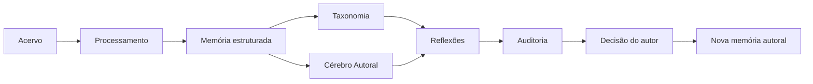
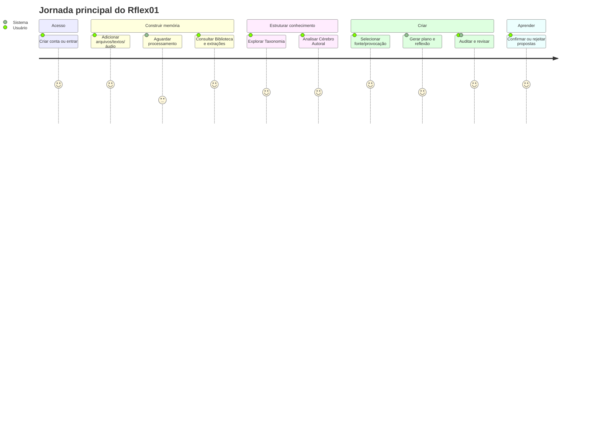
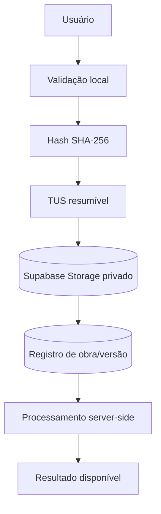
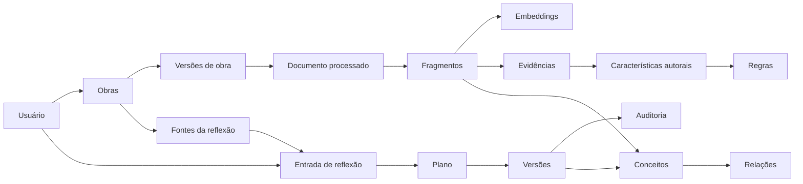
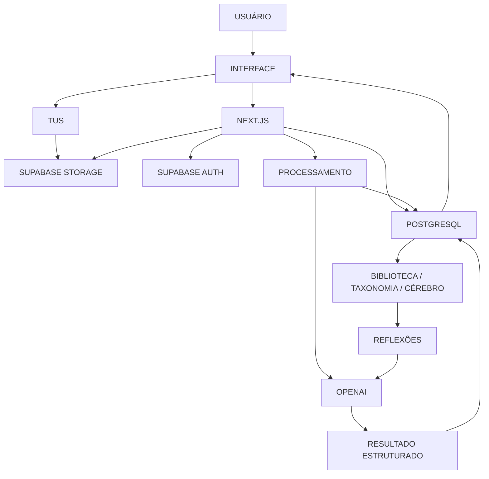
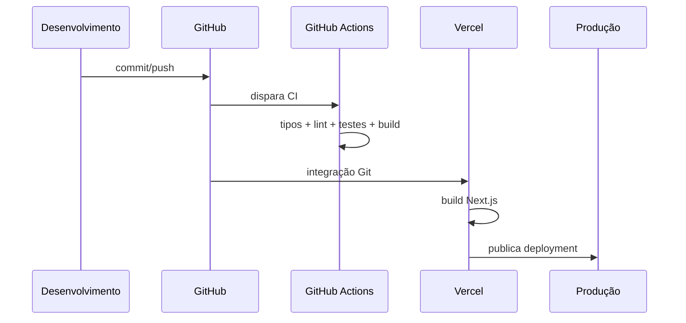

# ESCOPO DO APLICATIVO — Rflex01

**Memória Reflexiva — Cérebro Autoral**

**Status do documento:** apresentação funcional e arquitetural do produto baseada no sistema real revalidado na Etapa 3.

> Este documento explica o Rflex01 para clientes, parceiros, colaboradores, desenvolvedores, fornecedores e novos integrantes sem exigir leitura imediata do código. Para implementação, operação e manutenção detalhadas, a referência principal é o README.md.

---

## Índice

1. [Identificação do projeto](#1-identificação-do-projeto)
2. [Visão executiva](#2-visão-executiva)
3. [Problema que o aplicativo pretende resolver](#3-problema-que-o-aplicativo-pretende-resolver)
4. [Proposta do produto](#4-proposta-do-produto)
5. [Público e contexto de utilização](#5-público-e-contexto-de-utilização)
6. [Funcionalidades gerais](#6-funcionalidades-gerais)
7. [Funcionalidades detalhadas](#7-funcionalidades-detalhadas)
8. [Jornada do usuário](#8-jornada-do-usuário)
9. [Páginas do aplicativo](#9-páginas-do-aplicativo)
10. [Upload e documentos](#10-upload-e-documentos)
11. [Biblioteca](#11-biblioteca)
12. [Processamento de arquivos](#12-processamento-de-arquivos)
13. [Inteligência artificial](#13-inteligência-artificial)
14. [Arquitetura tecnológica](#14-arquitetura-tecnológica)
15. [GitHub](#15-github)
16. [Supabase](#16-supabase)
17. [Banco de dados](#17-banco-de-dados)
18. [Modelo de dados](#18-modelo-de-dados)
19. [Supabase Functions e automações](#19-supabase-functions-e-automações)
20. [Storage](#20-storage)
21. [Vercel](#21-vercel)
22. [Arquitetura de integração](#22-arquitetura-de-integração)
23. [Segurança](#23-segurança)
24. [Privacidade e proteção de dados](#24-privacidade-e-proteção-de-dados)
25. [Estado atual de desenvolvimento](#25-estado-atual-de-desenvolvimento)
26. [Limitações atuais](#26-limitações-atuais)
27. [Dependências externas](#27-dependências-externas)
28. [Infraestrutura](#28-infraestrutura)
29. [Operação](#29-operação)
30. [Processo de deployment](#30-processo-de-deployment)
31. [Manutenção](#31-manutenção)
32. [Glossário para não técnicos](#32-glossário-para-não-técnicos)
33. [Visão consolidada](#33-visão-consolidada)

---

## 1. Identificação do projeto

| Item | Identificação verificada |
|---|---|
| Produto | Rflex01 |
| Identidade descritiva | Memória Reflexiva — Cérebro Autoral |
| Repositório | villacanabrava-maker/reflex-01 |
| Branch de produção | main |
| Hospedagem | Vercel |
| Projeto Vercel | rflex01 |
| Domínio canônico | https://reflex-01.vercel.app |
| Backend de dados | Supabase |
| Projeto Supabase | reflex-01 |
| Banco | PostgreSQL 17 |
| Framework principal | Next.js 15.5.25 + React 19 |

O Rflex01 é uma aplicação web privada orientada a memória intelectual, processamento de documentos, organização conceitual e construção de novas reflexões com apoio de inteligência artificial.

## 2. Visão executiva

O Rflex01 organiza um acervo de textos, documentos, áudios e referências e os transforma em uma base estruturada que pode ser pesquisada, analisada e utilizada como contexto para novas produções intelectuais.

A arquitetura atual separa responsabilidades em seis áreas funcionais principais:

1. **Biblioteca** — registra e preserva fontes e obras.
2. **Processamento** — extrai, divide, vetoriza e sintetiza documentos.
3. **Taxonomia** — identifica conceitos e relações.
4. **Cérebro Autoral** — representa dimensões, características, regras e evidências do modo de pensar/escrever do autor.
5. **Reflexões** — transforma fontes, contexto e regras em planos e versões de novos textos.
6. **Auditoria** — avalia versões de reflexão segundo fidelidade, evidências, regras e riscos.

A proposta técnica comprovada não é simplesmente “gerar textos com IA”. O sistema tenta manter rastreabilidade entre fonte, fragmento, conceito, regra autoral, versão gerada e decisão humana.

## 3. Problema que o aplicativo pretende resolver

Com base no código e nos documentos existentes, o problema central tratado pelo Rflex01 é a dificuldade de transformar um acervo intelectual disperso em uma memória estruturada e reutilizável para consulta, análise e produção de novas reflexões.

O projeto aborda especificamente:

- preservação de arquivos e fontes originais;
- organização de obras por natureza e participação no Cérebro;
- decomposição de documentos em fragmentos recuperáveis;
- busca por semântica e texto;
- mapeamento de conceitos;
- identificação de características e regras autorais;
- criação de novas reflexões sustentadas por contexto e evidências;
- revisão humana e auditoria do resultado.

Não há, no estado atual do projeto, base documental suficiente para afirmar estratégia comercial, mercado-alvo, precificação ou modelo de negócio. Esses pontos permanecem fora deste escopo.

## 4. Proposta do produto

A proposta comprovada do Rflex01 pode ser resumida em um ciclo:

O valor funcional está na ligação entre acervo, processamento, contexto autoral e produção de novas versões, em vez de tratar cada conversa ou documento como elemento isolado.

## 5. Público e contexto de utilização

O código identifica o usuário principal como **autor** e apresenta o produto como “seu espaço de memória e criação”. O contexto confirmado é, portanto, uso individual/autoral com conta autenticada.

Podem compreender ou operar o sistema:

- proprietário/autor;
- desenvolvedor responsável pela evolução técnica;
- colaborador com acesso autorizado;
- parceiro ou fornecedor técnico que precise entender integrações;
- novo integrante que precise conhecer arquitetura e fluxos.

Não foi encontrada definição formal de segmentos comerciais adicionais; por isso este documento não os inventa.

## 6. Funcionalidades gerais

| Área | Função principal | Estado |
|---|---|---|
| Autenticação | Criar conta, login, sessão e logout | Implementado |
| Home | Visão consolidada do acervo, processamento, Cérebro e Reflexões | Implementado |
| Biblioteca | Adicionar, listar, filtrar, visualizar e excluir conteúdos | Implementado |
| Upload | TUS resumível direto para Storage privado | Implementado |
| Áudio | Gravação/upload e transcrição | Implementado |
| Processamento | Extração, seções, fragmentos, embeddings, sínteses | Implementado |
| Busca híbrida | Similaridade vetorial + full text | Implementado |
| Taxonomia | Conceitos, relações e análise automática | Implementado com corpus atual pequeno |
| Cérebro Autoral | Dimensões, características, regras, evidências e propostas | Implementado |
| Reflexões | Fontes, dossiê, plano, redação, revisão e versões | Implementado |
| Auditoria | Avaliação independente da versão | Implementado |
| Reflexão → Biblioteca | Incorporar texto aprovado ao acervo | Parcialmente implementado; RPC incompatível |
| Telemetria completa de IA | Registrar chamadas/tokens/latência em tabela dedicada | Parcialmente implementado |
| Edge Functions | Funções Supabase de borda | Não iniciado/não implementado |

## 7. Funcionalidades detalhadas

### 7.1 Gestão do acervo

O usuário pode adicionar arquivo, gravar áudio, escrever texto, registrar relato, carta ou reflexão. O sistema registra metadados, hash SHA-256, arquivo no Storage e uma versão da obra no banco.

### 7.2 Classificação da fonte

O cadastro distingue eixos como papel_fonte e participacao_cerebro, permitindo separar material autoral, referência e influência deliberada.

### 7.3 Processamento

Depois do registro, o pipeline pode extrair texto, construir estrutura, fragmentar o conteúdo, gerar embeddings, produzir sínteses e taxonomizar.

### 7.4 Recuperação

Fragmentos possuem representação textual e vetorial. A busca híbrida combina sinais lexical e semântico.

### 7.5 Cérebro Autoral

Fragmentos autorais alimentam análises por dimensão. A IA produz características, regras e evidências, que ficam estruturadas no banco.

### 7.6 Reflexões

O usuário pode partir de fontes internas/externas, montar contexto, gerar plano, redigir versões, revisar, editar, auditar e decidir.

### 7.7 Aprendizado por edição

Edições humanas podem gerar propostas de aprendizado. O sistema preserva a soberania do autor ao exigir confirmação/rejeição antes de tornar uma proposta elegível.

## 8. Jornada do usuário

A etapa final de incorporar uma reflexão aprovada novamente à Biblioteca está presente como intenção e implementação parcial, mas atualmente possui incompatibilidade técnica confirmada na RPC do banco.

## 9. Páginas do aplicativo

### /login

**Objetivo:** autenticação e cadastro.  
**Funcionalidades:** entrar, criar conta, validar senha, iniciar sessão.  
**Integrações:** Supabase Auth, sistema.usuarios.  
**Fluxo:** formulário → Server Action → Supabase Auth → sessão → dashboard.

### /

**Objetivo:** painel inicial.  
**Funcionalidades:** resumo do acervo, processamento, Cérebro, Reflexões e atalhos.  
**Integrações:** Biblioteca, Cérebro, Reflexões e Processamento.

### /biblioteca

**Objetivo:** gerir acervo.  
**Funcionalidades:** busca, filtros, upload, áudio, texto, relato, carta, reflexão.  
**Integrações:** Storage, biblioteca.*, Taxonomia e processamento.

### /biblioteca/[id]

**Objetivo:** detalhes de uma obra.  
**Funcionalidades:** visualizar metadados, dados processados, seções/fragmentos e original quando disponível.  
**Integrações:** Biblioteca, Processamento, Storage.

### /documentos-processados

**Objetivo:** consultar documentos que passaram pelo pipeline.  
**Funcionalidades:** listar e abrir resultados.  
**Integrações:** views de processamento.

### /documentos-processados/[id]

**Objetivo:** inspecionar a decomposição de um documento.  
**Funcionalidades:** consultar seções, fragmentos, sínteses e elementos disponíveis.  
**Integrações:** processamento.*.

### /cerebro

**Objetivo:** representar o perfil autoral estruturado.  
**Funcionalidades:** ver dimensões, características, regras e propostas; acionar análise.  
**Integrações:** cerebro_autoral.*, processamento.evidencias, OpenAI.

### /taxonomia

**Objetivo:** mapa conceitual.  
**Funcionalidades:** consultar conceitos, relações e itens em revisão.  
**Integrações:** taxonomia.*, OpenAI.

### /reflexoes

**Objetivo:** histórico de Reflexões.  
**Funcionalidades:** listar, filtrar, abrir e iniciar novas reflexões.  
**Integrações:** reflexoes.*.

### /reflexoes/criar

**Objetivo:** iniciar jornada reflexiva.  
**Funcionalidades:** preparar fontes, definir intenção, gerar contexto/plano e avançar no fluxo.  
**Integrações:** Biblioteca, Storage, Readability, áudio, OpenAI, Taxonomia e Cérebro.

### /reflexoes/[id]

**Objetivo:** estúdio de edição e revisão.  
**Funcionalidades:** ler plano, versões, citações, auditoria, editar e decidir.  
**Integrações:** reflexoes.*, auditoria.*, cerebro_autoral.*.

### /configuracoes

**Objetivo:** conta e diagnóstico.  
**Funcionalidades:** perfil, estado do banco, presença do serviço de IA e logout.  
**Integrações:** Supabase, variáveis server-side.

A tela ainda mostra “Voz e áudio — Em breve”, embora gravação e transcrição já existam em outros fluxos. Essa é uma divergência de interface conhecida.

## 10. Upload e documentos

O upload foi desenhado para não transportar o arquivo completo pelo servidor Vercel durante o envio.

Características atuais:

- limite da Biblioteca: 50 MB;
- chunks TUS: 6 MB;
- retries no cliente;
- retomada de upload incompleto;
- buckets privados;
- caminho do objeto começa com id do usuário;
- URL assinada para download;
- tipos aceitos incluem PDF, DOCX, TXT, Markdown, EPUB e áudio, mas aceitar upload não equivale a ter parser completo.

## 11. Biblioteca

A Biblioteca combina três elementos:

1. **Registro lógico da obra** — título, autoria, tipo, natureza e papel no Cérebro.
2. **Versão de arquivo** — caminho, nome, MIME, hash e estado do processamento.
3. **Objeto privado** — arquivo original no Storage.

Isso permite preservar o original e criar representações processadas sem substituir o arquivo fonte.

Na revalidação, o banco tinha 3 obras e 3 versões, mostrando que o fluxo já foi utilizado no ambiente real.

## 12. Processamento de arquivos

### Formatos

| Formato | Situação |
|---|---|
| PDF | Implementado |
| DOCX | Implementado |
| TXT | Implementado |
| Markdown | Implementado |
| EPUB | Parcial: aceito no upload, sem parser próprio |
| DOC legado | Não implementado |
| Áudio | Transcrito para texto por fluxo específico |

### Pipeline

1. lê a versão da obra;
2. baixa o arquivo do Storage;
3. extrai e normaliza texto;
4. detecta estrutura/seções;
5. fragmenta;
6. cria unidades de conhecimento;
7. gera embeddings;
8. cria sínteses hierárquicas;
9. publica documento processado;
10. aciona Taxonomia automática sem tornar essa etapa destrutiva para a publicação.

Na revalidação havia 2 documentos processados, 12 seções, 38 fragmentos, 38 vetores, 87 evidências e 3 execuções registradas.

## 13. Inteligência artificial

A IA aparece como infraestrutura especializada dentro de fluxos específicos.

### Papel da IA

- transformar fragmentos em sínteses;
- extrair conceitos taxonômicos;
- analisar dimensões do Cérebro;
- gerar planos de Reflexão;
- redigir versões;
- auditar versões;
- gerar embeddings;
- transcrever áudio.

### Entradas

Dependendo do fluxo, entram:

- fragmentos de obras;
- metadados;
- fontes escolhidas;
- regras e características do Cérebro;
- evidências;
- intenção do usuário;
- versão gerada.

### Processamento

O orquestrador central usa Structured Outputs com Zod e papéis lógicos como análise, Cérebro, redação e auditoria. Material externo é delimitado para ser tratado como dado.

### Saídas

As saídas estruturadas são persistidas em tabelas de Processamento, Taxonomia, Cérebro, Reflexões e Auditoria.

### Modelos verificáveis no código

- gpt-4o como padrão em chamadas estruturadas;
- text-embedding-3-small em 1536 dimensões;
- gpt-transcribe para áudio.

### Limitação

Embeddings possuem fallback determinístico baseado em hash quando OpenAI não está disponível. Esse vetor preserva dimensão e determinismo, mas não oferece a mesma semântica de um embedding aprendido.

## 14. Arquitetura tecnológica

| Camada | Tecnologia | Responsabilidade |
|---|---|---|
| Front-end | React 19 + Next.js | interface e navegação |
| Back-end web | Next.js Server Actions | autenticação, regras, orquestração |
| Banco | PostgreSQL/Supabase | persistência, funções, views, políticas |
| Arquivos | Supabase Storage | originais e fontes privadas |
| Identidade | Supabase Auth | usuários e sessões |
| IA | OpenAI | análise, geração, embeddings, áudio |
| Busca vetorial | pgvector | similaridade semântica |
| Upload | TUS | envio resumível |
| Deploy | Vercel | build e runtime |
| Código/CI | GitHub + Actions | versionamento e validação |

## 15. GitHub

O GitHub é a fonte de versionamento do código e da documentação.

- repositório: villacanabrava-maker/reflex-01;
- branch principal: main;
- CI em push e pull request para main;
- testes de tipos, lint, Vitest e build;
- integração direta com Vercel.

A main não possuía proteção formal no momento da revalidação.

## 16. Supabase

O Supabase concentra quatro funções essenciais:

1. **Authentication** — identidade e sessão;
2. **Database** — dados relacionais, views, funções, triggers e RPCs;
3. **Storage** — arquivos privados;
4. **RLS/policies** — controle de acesso por linha/objeto.

O projeto canônico reflex-01 estava ACTIVE_HEALTHY na revalidação.

## 17. Banco de dados

O modelo está dividido em schemas por responsabilidade.

### sistema

- usuarios;
- modelos_ia;
- prompts;
- versoes_prompts;
- versoes_pipeline;
- configuracoes_usuario;
- perfis_embedding.

### biblioteca

- obras;
- versoes_obras;
- fontes_obras.

### processamento

- unidades_conhecimento;
- documentos_processados;
- secoes;
- fragmentos;
- sinteses;
- vetores;
- elementos;
- evidencias;
- execucoes;
- etapas_execucao.

### taxonomia

- versoes;
- conceitos;
- termos;
- relacoes;
- conceitos_fragmentos;
- conceitos_reflexoes;
- analises.

### cerebro_autoral

- dimensoes;
- caracteristicas;
- regras;
- versoes_cerebro;
- propostas_atualizacao;
- metodologias;
- etapas_metodologia.

### reflexoes

- entradas;
- fontes_entrada;
- planos_reflexao;
- versoes_reflexao;
- citacoes_evidencias;
- revisoes_autor;
- contextos;
- citacoes_verificadas.

### auditoria

- relatorios_auditoria;
- execucoes_ia.

### public

- _migrations e wrappers de views.

O README.md contém o inventário técnico tabela por tabela, com colunas, relacionamentos, leitura, escrita e políticas.

## 18. Modelo de dados

O modelo busca manter proveniência: a informação processada não é tratada apenas como texto final, mas relacionada à obra, versão, fragmento, conceito, regra e versão de Reflexão quando aplicável.

## 19. Supabase Functions e automações

### Funções/RPCs confirmadas

- cadastrar_obra_com_versao;
- buscar_fragmentos_hibrido;
- incorporar_reflexao_como_obra;
- backend_iniciar_processamento;
- backend_registrar_workflow_iniciado;
- backend_falhar_execucao;
- listar_obras;
- registrar_obra_arquivo;
- helpers de trigger em sistema.

Nem todas possuem caller atual no código.

### Triggers confirmados

- criação de auth.users → provisionamento de sistema.usuarios;
- atualização automática de atualizado_em em tabelas selecionadas.

### Edge Functions

Nenhuma Edge Function estava configurada.

### Automação de aplicação

Grande parte da automação ocorre por Server Actions e funções TypeScript, não por Edge Functions.

## 20. Storage

### originais-biblioteca

- privado;
- limite 50 MB;
- armazena originais da Biblioteca;
- permite PDF, EPUB, DOCX, texto/Markdown e áudio;
- policies vinculam o primeiro diretório ao auth.uid.

### fontes-reflexoes

- privado;
- limite 50 MB;
- armazena fontes específicas de Reflexões;
- permite PDF, DOCX, texto/Markdown e áudio;
- policies também isolam por usuário.

Na revalidação existiam 2 objetos no primeiro bucket e 1 no segundo.

## 21. Vercel

O Vercel hospeda a aplicação Next.js.

### Hospedagem

Projeto canônico: rflex01.

### Build

O deployment verificado:

- clonou main;
- commit: 860e4de…;
- detectou Next.js 15.5.25;
- compilou com sucesso;
- validou tipos;
- gerou rotas;
- criou funções serverless;
- concluiu deploy.

### Deployment

O deploy de produção auditado estava READY.

### GitHub

O projeto Vercel está integrado ao repositório villacanabrava-maker/reflex-01 e usa main como branch de produção.

## 22. Arquitetura de integração

No upload de arquivo, existe um atalho proposital: o browser envia diretamente ao Storage. Nos fluxos de domínio, Next.js coordena banco, Storage e IA.

## 23. Segurança

Controles realmente existentes incluem:

- autenticação;
- sessão por Supabase;
- middleware de rotas;
- buckets privados;
- policies de Storage;
- RLS em grande parte das tabelas;
- isolamento por usuario_id;
- chaves administrativas mantidas no servidor pelo desenho do código;
- URL assinada para download;
- hash SHA-256;
- proteção estrutural de material externo no orquestrador;
- validação de schema para saídas de IA.

Há também riscos confirmados:

- seis tabelas de sistema sem RLS;
- authenticated com privilégios amplos nessas tabelas;
- cinco tabelas com RLS sem policy direta;
- proteção de senhas vazadas desativada no Auth;
- branch main sem branch protection.

Portanto, este documento não classifica o sistema como “seguro” de forma absoluta.

## 24. Privacidade e proteção de dados

Controles técnicos confirmados:

- buckets não públicos;
- acesso a objetos condicionado à identidade;
- rotas privadas protegidas;
- RLS em grande parte dos dados do usuário;
- credenciais server-side separadas do browser;
- URLs temporárias para download.

Este documento **não faz alegação de conformidade jurídica** com LGPD, GDPR ou outra legislação. Não foi realizada auditoria jurídica nem revisão de políticas de privacidade/termos.

## 25. Estado atual de desenvolvimento

### Implementado

- autenticação e sessões;
- dashboard;
- Biblioteca;
- upload resumível;
- áudio/transcrição;
- processamento PDF/DOCX/TXT/Markdown;
- busca híbrida;
- embeddings;
- sínteses;
- Taxonomia;
- Cérebro Autoral;
- Reflexões;
- Auditoria;
- CI;
- deployment Vercel;
- Storage privado.

### Parcialmente implementado

- EPUB: upload aceito sem parser específico;
- incorporação Reflexão → Biblioteca: implementação presente, RPC incompatível;
- telemetria de IA: tabela existe sem integração completa comprovada;
- metodologias/contextos/citações verificadas: estruturas presentes com uso atual limitado ou não comprovado;
- página Configurações: alguns itens informativos ainda não correspondem a controles funcionais.

### Planejado

- integrações externas opcionais aparecem na interface como “Em breve”.

### Não iniciado / não implementado

- parser .doc legado;
- Edge Functions;
- API REST própria em app/api;
- scripts locais DB funcionais correspondentes aos nomes db:migrate e db:test;
- proteção de branch main.

## 26. Limitações atuais

- 50 MB por arquivo de Biblioteca;
- 24 MB no fluxo de áudio da UI;
- EPUB inconsistente;
- .doc sem suporte;
- dependência do runtime Vercel para processamento longo;
- fallback não semântico para embeddings;
- corpus taxonômico atual com zero conceitos persistidos;
- algumas estruturas de dados ainda vazias;
- escopos completos de env vars no Vercel não foram acessíveis;
- incorporação final de Reflexão não pode ser tratada como operacional.

## 27. Dependências externas

| Dependência | Função | Consequência de indisponibilidade |
|---|---|---|
| Vercel | hospedar/buildar Next.js | interface/backend web indisponíveis |
| Supabase Auth | login/sessão | usuário não autentica |
| Supabase PostgreSQL | persistência | dados e fluxos param |
| Supabase Storage | arquivos | upload/download falham |
| OpenAI | análise, geração, transcrição, embeddings | IA falha ou embedding usa fallback em parte do pipeline |
| GitHub | versão/CI/origem do deploy | desenvolvimento e deploy automático afetados |
| DNS/domínio Vercel | acesso público | URL canônica pode ficar inacessível |

## 28. Infraestrutura

### Produção

- GitHub main → Vercel production;
- Supabase reflex-01;
- OpenAI via variável server-side;
- Storage Supabase;
- PostgreSQL + pgvector.

### CI

GitHub Actions usa Node 22 e executa:

1. npm ci;
2. tsc --noEmit;
3. npm run lint;
4. npm test;
5. npm run build.

### Runtime Vercel

O projeto está configurado com Node 24.x. O build atual gerou funções serverless e middleware.

## 29. Operação

A operação diária pode ser entendida em três níveis.

### Usuário

- autenticar;
- adicionar fontes;
- acompanhar processamento;
- usar Biblioteca, Taxonomia e Cérebro;
- criar/refinar Reflexões;
- revisar propostas/aprovar versões.

### Aplicação

- manter sessão;
- validar entradas;
- armazenar arquivos;
- processar conteúdo;
- chamar IA;
- persistir resultados;
- revalidar páginas.

### Técnico

- acompanhar CI;
- analisar logs Vercel;
- inspecionar execuções no banco;
- revisar advisors Supabase;
- manter migrations;
- conferir divergências entre documentação e runtime.

## 30. Processo de deployment

CI e deploy são mecanismos relacionados, porém independentes: um valida; o outro publica.

## 31. Manutenção

Princípios úteis para manutenção do estado atual:

- considerar main + Supabase + Vercel como realidade operacional;
- usar migrations em supabase/migrations como histórico de evolução;
- não reorganizar migrations já aplicadas;
- não expor segredos;
- revalidar schema antes de escrever RPC;
- manter documentação separando implementado, parcial, planejado e não implementado;
- investigar antes de remover índices marcados apenas como “unused”;
- manter upload e processamento como preocupações separadas;
- preservar provenance entre fonte e resultado;
- testar fluxos de autenticação e isolamento ao mudar acesso.

Problemas conhecidos devem ser tratados em etapa funcional própria, não silenciosamente dentro de mudanças documentais.

## 32. Glossário para não técnicos

| Termo | Significado |
|---|---|
| Aplicativo web | sistema usado pelo navegador |
| Front-end | parte visual com que o usuário interage |
| Back-end | lógica executada no servidor |
| Banco de dados | armazenamento estruturado de registros |
| Supabase | plataforma de banco, autenticação e arquivos |
| PostgreSQL | tecnologia do banco relacional |
| Storage | local para arquivos binários |
| Bucket | “pasta-raiz” administrada pelo Storage |
| Auth | autenticação de usuário |
| RLS | regra que limita quais linhas do banco o usuário acessa |
| Function/RPC | função executada no banco |
| Trigger | ação automática disparada por alteração de dados |
| Migration | mudança versionada no schema |
| Edge Function | função de backend do Supabase; não usada atualmente |
| Vercel | serviço de build e hospedagem |
| GitHub | repositório/versionamento de código |
| Branch | linha separada de desenvolvimento |
| Commit | registro versionado de uma mudança |
| CI | validação automática do código |
| Deployment | versão publicada do app |
| Serverless | execução de backend sob demanda pela plataforma |
| Server Action | função Next.js executada no servidor |
| TUS | protocolo de upload retomável |
| Embedding | representação numérica usada em busca semântica |
| pgvector | extensão do banco que trabalha com embeddings |
| Taxonomia | conjunto estruturado de conceitos e relações |
| Cérebro Autoral | representação estruturada de características, regras e evidências autorais |
| Structured Outputs | resposta de IA obrigada a seguir formato definido |
| Proveniência | capacidade de rastrear de onde uma informação veio |

## 33. Visão consolidada

O Rflex01 atualmente forma um produto único por encadear três movimentos:

### 1. Preservar

A Biblioteca registra obras e mantém originais privados no Storage.

### 2. Estruturar

O pipeline transforma arquivos em seções, fragmentos, vetores, sínteses e conceitos. O Cérebro Autoral organiza características e regras apoiadas em evidências.

### 3. Produzir com controle

Reflexões usa fontes, contexto e regras para produzir planos e versões. A Auditoria examina o resultado e o usuário permanece responsável pela revisão e decisão final.

### Estado consolidado

O núcleo do produto está implementado e implantado. O sistema já possui dados reais em Biblioteca, Processamento, Cérebro, Reflexões e Auditoria. Algumas frentes permanecem parciais — principalmente EPUB, telemetria de IA e incorporação Reflexão → Biblioteca — e foram explicitadas sem serem apresentadas como concluídas.

### Regra de leitura deste documento

Este escopo é uma representação do estado revalidado na Etapa 3. Em caso de divergência futura, GitHub main, Supabase canônico, Vercel canônico e o aplicativo real devem ser verificados novamente.

---

**Documento produzido na Etapa 3 — Documentação Mestre, README Definitivo e Escopo do Aplicativo.**
