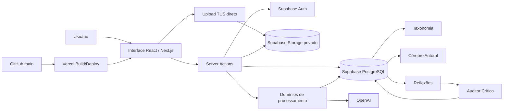
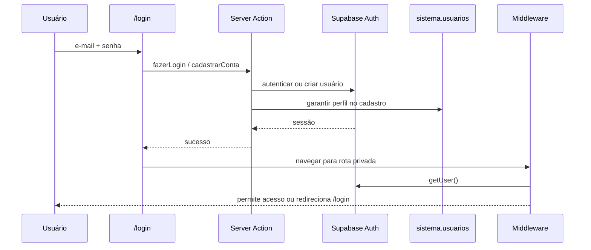
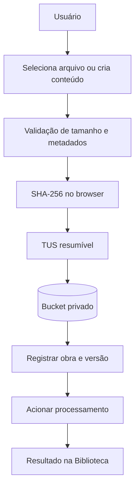
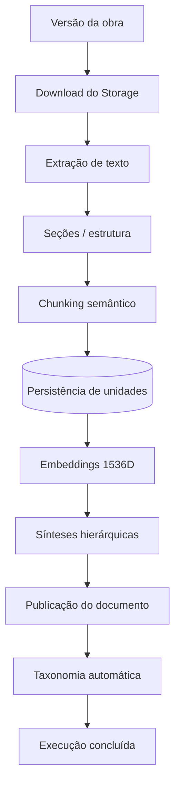
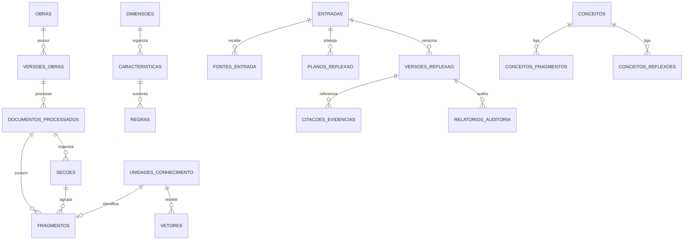
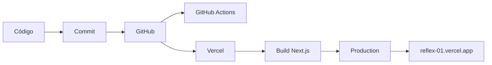
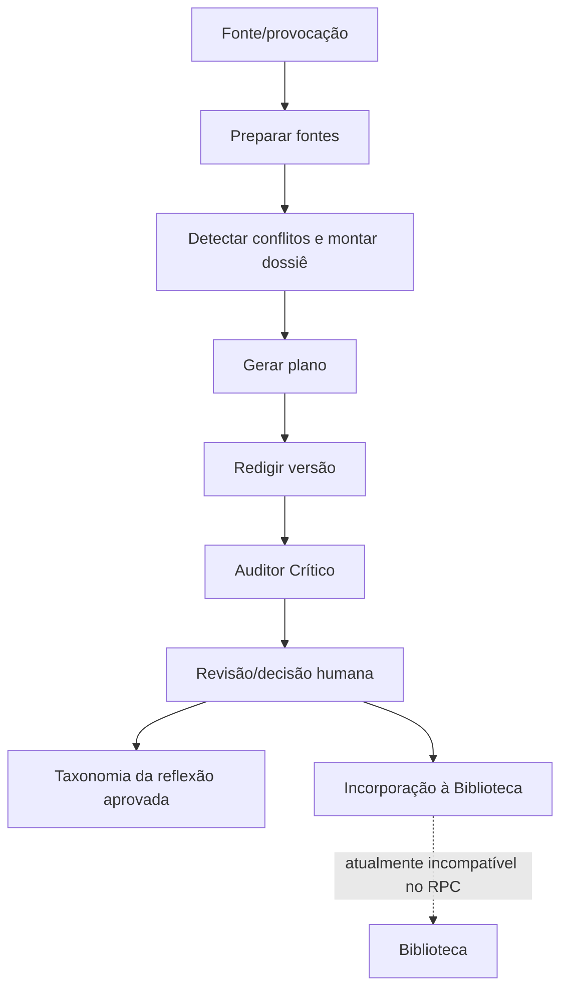

# Rflex01 — Documentação Mestre do Aplicativo

**Memória Reflexiva — Cérebro Autoral**

> Seu acervo. Seu pensamento. Novas reflexões.

Este README é o **mapa mestre técnico e operacional** do Rflex01. Ele foi reconstruído na Etapa 3 a partir do estado real do repositório, do banco Supabase, do deploy Vercel e do aplicativo implantado. Documentação histórica é auxiliar: quando houver divergência, o código e as integrações atuais prevalecem.

## Índice

1. [Nome do aplicativo](#1-nome-do-aplicativo)
2. [Visão geral](#2-visão-geral)
3. [Objetivo do aplicativo](#3-objetivo-do-aplicativo)
4. [Estado atual](#4-estado-atual)
5. [Arquitetura geral](#5-arquitetura-geral)
6. [Tecnologias utilizadas](#6-tecnologias-utilizadas)
7. [Estrutura do repositório](#7-estrutura-do-repositório)
8. [Front-end](#8-front-end)
9. [Páginas do aplicativo](#9-páginas-do-aplicativo)
10. [Back-end](#10-back-end)
11. [Autenticação](#11-autenticação)
12. [Upload de arquivos](#12-upload-de-arquivos)
13. [Biblioteca](#13-biblioteca)
14. [Processamento de documentos](#14-processamento-de-documentos)
15. [Arquivos grandes](#15-arquivos-grandes)
16. [Inteligência artificial](#16-inteligência-artificial)
17. [Supabase](#17-supabase)
18. [Tabelas do Supabase](#18-tabelas-do-supabase)
19. [Relacionamentos do banco](#19-relacionamentos-do-banco)
20. [Storage](#20-storage)
21. [Vercel](#21-vercel)
22. [Variáveis de ambiente](#22-variáveis-de-ambiente)
23. [GitHub](#23-github)
24. [Fluxo de deployment](#24-fluxo-de-deployment)
25. [Fluxos principais do sistema](#25-fluxos-principais-do-sistema)
26. [Segurança](#26-segurança)
27. [Tratamento de erros](#27-tratamento-de-erros)
28. [Logs e observabilidade](#28-logs-e-observabilidade)
29. [Limitações atuais](#29-limitações-atuais)
30. [Problemas conhecidos](#30-problemas-conhecidos)
31. [Estrutura documental](#31-estrutura-documental)
32. [Guia para quem está chegando no projeto](#32-guia-para-quem-está-chegando-no-projeto)
33. [Glossário](#33-glossário)

---

## 1. Nome do aplicativo

**Nome técnico oficial:** Rflex01  
**Identidade descritiva:** Memória Reflexiva — Cérebro Autoral  
**Pacote npm:** rflex01  
**Repositório:** villacanabrava-maker/reflex-01  
**Projeto Vercel canônico:** rflex01  
**Projeto Supabase canônico:** reflex-01  
**Branch de produção:** main  
**Domínio canônico verificado:** https://reflex-01.vercel.app

O repositório GitHub ainda possui o campo de homepage apontando para um domínio histórico diferente. Isso é uma **divergência de metadado**, não evidência de que o domínio histórico seja a produção canônica.

**Como foi verificado.** Metadados do repositório, projeto Vercel, deployment atual e projeto Supabase foram consultados diretamente; o domínio canônico também foi requisitado e respondeu com a tela de login do Rflex01.

## 2. Visão geral

Rflex01 é uma aplicação web privada para organizar um acervo intelectual, processar documentos, decompor conteúdo em unidades recuperáveis, estruturar uma Taxonomia, representar características e regras de um Cérebro Autoral e apoiar a criação de novas Reflexões com fontes, planejamento, redação, revisão e auditoria.

Em linguagem simples: a Biblioteca guarda as fontes; o Processamento transforma arquivos em informação utilizável; a Taxonomia organiza conceitos; o Cérebro Autoral registra padrões e regras; Reflexões usa esses elementos para construir textos; a Auditoria verifica o resultado antes da decisão final do autor.

**Como foi verificado.** Rotas, componentes, Server Actions, domínios de negócio, tabelas e registros atuais foram cruzados entre GitHub e Supabase.

## 3. Objetivo do aplicativo

O objetivo comprovável no código é manter uma memória autoral estruturada e utilizá-la como contexto para novas reflexões, preservando distinções entre material autoral, referências externas, evidências, regras do autor e decisões humanas.

O projeto não deve ser descrito como um produto que “substitui o autor”. O código contém etapas de confirmação/revisão e propostas de aprendizado que dependem de decisão do usuário.

**Como foi verificado.** Metadados do produto, classificações de fonte, regras do Cérebro, fluxo de revisão e tabelas de propostas foram conferidos.

## 4. Estado atual

### Implementado

- autenticação por e-mail e senha;
- cadastro de conta por backend administrativo com e-mail confirmado pelo próprio fluxo atual;
- proteção de rotas privadas por middleware;
- Biblioteca com cadastro, upload, busca, filtros, visualização e exclusão;
- upload resumível TUS direto do browser para Storage privado;
- limite de Biblioteca de 50 MB;
- gravação/upload de áudio e transcrição, com limite de UI de 24 MB;
- extração de PDF, DOCX, TXT e Markdown;
- pipeline de seções, fragmentos, embeddings, sínteses e publicação;
- busca híbrida textual + vetorial;
- motor de Taxonomia;
- Cérebro Autoral com 18 dimensões, características, regras e propostas;
- criação, planejamento, redação, edição, revisão e auditoria de Reflexões;
- Vercel em produção e CI do GitHub com TypeScript, lint, testes e build.

### Parcialmente implementado

- **EPUB:** é aceito pela interface e pelo bucket, porém não existe parser EPUB específico; o extrator atual classifica ZIP não-PDF como DOCX;
- **incorporação Reflexão → Biblioteca:** existe ação e RPC, porém a função PostgreSQL atual referencia colunas de um schema antigo;
- **telemetria de IA:** existe a tabela auditoria.execucoes_ia, porém não foi comprovada integração de runtime e ela está vazia;
- **metodologias/contextos/citações verificadas:** estruturas existem, mas não há registros atuais e parte do fluxo não pôde ser comprovada como ativa;
- **Configurações:** possui diagnóstico e elementos de interface, mas alguns itens são apenas superfície de UI.

### Planejado

Somente itens explicitamente representados por estruturas ou mensagens do projeto devem receber este rótulo. A tela de Configurações ainda mostra **Integrações — Em breve**. Não há base para inventar roadmap comercial adicional.

### Não implementado

- parser para Word legado .doc;
- API REST própria em src/app/api ou src/pages/api;
- Supabase Edge Functions;
- scripts locais referidos por db:migrate e db:test, pois a main atual não possui o diretório scripts;
- proteção formal da branch main no GitHub.

**Como foi verificado.** Árvore do repositório, manifest de rotas do build Vercel, código de upload/processamento, inventário Supabase e configuração GitHub foram comparados.

## 5. Arquitetura geral



Há duas rotas técnicas importantes:

1. **Dados e regras:** Interface → Server Actions → Supabase/OpenAI.
2. **Arquivo grande:** Browser → TUS → Supabase Storage; depois o servidor lê o arquivo para processá-lo.

Não existe uma camada REST própria do Next.js na main atual. O backend web está concentrado principalmente em Server Actions, funções de domínio e RPCs do Supabase.

**Como foi verificado.** Árvore src/app, src/acoes, src/dominios e src/infraestrutura; ausência de app/api; build Vercel; bibliotecas TUS e Supabase.

## 6. Tecnologias utilizadas

| Tecnologia | Função no Rflex01 | Por que existe |
|---|---|---|
| Next.js 15.5.25 | App Router, Server Components, Server Actions, build e runtime | Une interface e backend web no mesmo projeto |
| React 19 | Componentes e interação de UI | Base da interface |
| TypeScript | Tipagem estática | Reduz inconsistências e melhora manutenção |
| Tailwind CSS | Estilos utilitários | Interface responsiva/editorial |
| Supabase Auth | Sessão e identidade | Login e isolamento por usuário |
| PostgreSQL 17 | Banco relacional | Integridade, relacionamentos, funções e políticas |
| Supabase Storage | Objetos privados | Preserva arquivos originais e fontes |
| Supabase RLS | Controle de linhas | Isolamento de dados por usuario_id quando configurado |
| pgvector 0.8.2 | Vetores 1536D | Recuperação semântica |
| Full Text Search | Busca lexical | Parte textual da busca híbrida |
| TUS / tus-js-client | Upload resumível | Evita transportar o arquivo inteiro pelo request Next.js |
| OpenAI SDK | IA generativa, embeddings e transcrição | Sínteses, Cérebro, Reflexões, Auditoria, vetores e áudio |
| Zod | Schemas/Structured Outputs | Valida respostas estruturadas da IA |
| pdf-parse + @napi-rs/canvas | Extração PDF | Leitura de PDF no servidor |
| Readability + jsdom | Extração de conteúdo web em Reflexões | Prepara links/fontes externas quando acionados |
| Vitest | Testes automatizados | Garante regressões básicas |
| GitHub Actions | CI | Executa tipos, lint, testes e build |
| Vercel | Hospedagem/build/serverless | Publicação da aplicação |

**Como foi verificado.** package.json, next.config.mjs, código de infraestrutura, extensões instaladas no Supabase e workflow de CI.

## 7. Estrutura do repositório

A main auditada continha 224 entradas na árvore Git e 162 arquivos versionados.

```text
reflex-01/
├─ .agents/                  instruções auxiliares para agentes
├─ .github/workflows/        pipeline de CI
├─ docs/                     documentação, relatórios e ADR
├─ src/
│  ├─ app/                   páginas e layouts do App Router
│  ├─ acoes/                 Server Actions
│  ├─ componentes/           componentes React
│  ├─ dominios/              regras de negócio
│  ├─ ia/                    cliente e orquestração OpenAI
│  ├─ infraestrutura/        Supabase, Auth e Storage/TUS
│  ├─ lib/                   limites e validações
│  ├─ tipos/                 tipos TypeScript
│  └─ middleware.ts          sessão e proteção de rotas
├─ supabase/migrations/      migrations 0001 a 0029
├─ tests/                    testes Vitest
├─ package.json
├─ next.config.mjs
├─ tsconfig.json
├─ eslint.config.mjs
├─ vitest.config.ts
└─ tailwind.config.ts
```

**Diretórios principais.** src/app define o que é acessível por URL; src/acoes faz a ponte servidor ↔ banco/domínio; src/dominios contém processamento e lógica cognitiva; src/infraestrutura concentra detalhes de provedores; supabase/migrations registra a evolução do banco.

**Atenção operacional.** package.json ainda contém db:migrate e db:test apontando para arquivos dentro de scripts/, mas esse diretório não existe na main atual. Não use esses dois comandos como instrução válida.

**Como foi verificado.** Árvore recursiva do commit de produção e arquivos de configuração atuais.

## 8. Front-end

O front-end usa App Router e separa o grupo de autenticação do dashboard. A navegação autenticada possui barra lateral desktop, barra inferior mobile, menu do usuário e cabeçalho.

Padrões principais:

- Server Components carregam dados sensíveis no servidor;
- componentes client-side são usados em formulários, modais, upload, wizard e interações;
- o dashboard consulta Biblioteca, Cérebro, Reflexões e Processamento;
- não há estado global central obrigatório: os fluxos dependem principalmente de props, Server Actions e revalidação de rotas.

**Como foi verificado.** layout do dashboard, páginas, componentes e imports das Server Actions.

## 9. Páginas do aplicativo

| Rota | Finalidade | Ações do usuário | Componentes/Backend | Dados principais |
|---|---|---|---|---|
| /login | Entrar ou criar conta | login, cadastro, mostrar senha | fazerLogin, cadastrarConta | Supabase Auth, sistema.usuarios |
| / | Home autenticada | navegar, adicionar arquivo, criar reflexão | ações de Biblioteca/Cérebro/Reflexões/Processamento | estatísticas, obras, cérebro, reflexões, processados |
| /biblioteca | Gerenciar acervo | buscar, filtrar, enviar, gravar áudio, escrever texto | ListaObras, ModalAdicionarConteudo, Server Actions | obras, versões, taxonomia, Storage |
| /biblioteca/[id] | Ver obra | ler metadados/extração, baixar original, processar quando aplicável | DetalheDocumentoComponente | obra, fragmentos, seções, documento processado |
| /documentos-processados | Auditoria do processamento | abrir documento processado | PainelDocumentosProcessados | view de documentos |
| /documentos-processados/[id] | Ver extração | navegar por material extraído | VisualizadorExtracaoLivro | seções, fragmentos, sínteses, elementos |
| /cerebro | Cérebro Autoral | consultar dimensões/regras, acionar análise, decidir propostas | PainelCerebroModerno | dimensões, características, regras, propostas |
| /taxonomia | Mapa conceitual | consultar conceitos/grafo e revisar relações | PainelTaxonomia | conceitos, relações, sugestões |
| /reflexoes | Histórico de reflexões | buscar/abrir/criar | ListaReflexoesModerna | entradas/últimas versões |
| /reflexoes/criar | Criar nova reflexão | percorrer wizard e preparar fontes | WizardCriarReflexao | fontes, Biblioteca, plano, IA |
| /reflexoes/[id] | Estúdio da reflexão | revisar versões, auditar, editar/aprovar | EstudioReflexao | entrada, plano, versões, citações, auditoria |
| /configuracoes | Conta e diagnóstico | ver perfil, logout e estado dos serviços | página server-side | perfil, contagens, DB, OPENAI_API_KEY presente/ausente |

**APIs utilizadas.** As páginas não chamam endpoints REST próprios; usam Server Actions, SDK Supabase e RPCs. Links e upload podem usar Storage diretamente no browser.

**Como foi verificado.** Cada page.tsx atual, seus imports, dados carregados e manifest de rotas produzido pelo build Vercel.

## 10. Back-end

O backend atual é formado por:

- **Server Actions:** auth.ts, biblioteca.ts, processamento.ts, taxonomia.ts, cerebro.ts, reflexoes.ts e auditoria.ts;
- **domínios:** validação, extração, chunking, embeddings, sínteses, taxonomia, Cérebro, Reflexões e Auditor Crítico;
- **Supabase:** tabelas, views, RLS, Storage, funções e RPC;
- **OpenAI:** chamadas de IA server-side;
- **middleware:** sessão e proteção de rotas.

### RPCs com caller atual comprovado

| RPC | Caller |
|---|---|
| cadastrar_obra_com_versao | src/acoes/biblioteca.ts |
| buscar_fragmentos_hibrido | src/acoes/processamento.ts |
| incorporar_reflexao_como_obra | src/acoes/reflexoes.ts |

Também existem backend_iniciar_processamento, backend_registrar_workflow_iniciado, backend_falhar_execucao, listar_obras e registrar_obra_arquivo no banco, porém nenhum caller atual foi comprovado na main auditada.

**Como foi verificado.** Busca de chamadas rpc no código e catálogo pg_proc do Supabase.

## 11. Autenticação



No cadastro, o código atual usa a Admin API, cria o usuário com e-mail confirmado e tenta assegurar o perfil em sistema.usuarios. No login, há inclusive um caminho de recuperação que tenta confirmar administrativamente um e-mail ainda pendente.

O banco possui trigger auth.users → sistema.manipular_novo_usuario_auth, além do upsert explícito no cadastro. Mesmo assim, a auditoria encontrou **2 usuários em auth.users e 1 perfil em sistema.usuarios**. A causa histórica dessa diferença não foi comprovada.

**Como foi verificado.** src/acoes/auth.ts, middleware e contagem direta no banco.

## 12. Upload de arquivos



O arquivo da Biblioteca vai **diretamente do browser ao Supabase Storage**, usando token da sessão. O cliente TUS usa chunks de 6 MB e tentativas de repetição em 0, 1, 3 e 5 segundos, podendo retomar upload anterior.

Para conteúdo escrito diretamente, o navegador cria um arquivo TXT e reutiliza o mesmo fluxo. Para áudio, o original é enviado, transcrito no servidor e o texto confirmado é preparado para processamento.

**Comportamento real:** o limite da Biblioteca é **50 MB**, apesar de comentário antigo no cliente TUS mencionar “centenas de megabytes”.

**Como foi verificado.** cliente-tus.ts, limites-upload.ts, schema Zod de cadastro, modal de conteúdo, buckets e policies de Storage.

## 13. Biblioteca

A Biblioteca é a origem do acervo. Cada obra possui metadados em biblioteca.obras e pelo menos uma versão em biblioteca.versoes_obras. O arquivo original fica no bucket privados originais-biblioteca, enquanto a view v_obras_detalhadas consolida informação para a UI.

Fluxo de leitura:

```mermaid
flowchart LR
    O[(biblioteca.obras)] --> V[(versoes_obras)]
    V --> ST[(Storage)]
    V --> DP[(documentos_processados)]
    DP --> F[(fragmentos)]
    O --> VIEW[v_obras_detalhadas]
    VIEW --> UI[/biblioteca]
```

Downloads usam URL assinada temporária. Exclusão remove objetos associados do Storage e depois o registro da obra; o banco remove dependências conforme constraints/cascatas definidas.

**Como foi verificado.** Server Actions da Biblioteca, views, Storage e schema atual.

## 14. Processamento de documentos

### Suporte de formatos

| Formato | Estado real | Como é tratado |
|---|---|---|
| PDF | Implementado | magic bytes %PDF, pdf-parse, extração de texto e páginas |
| DOCX | Implementado | leitura ZIP e word/document.xml com validações de limites |
| TXT | Implementado | UTF-8 |
| MD/Markdown | Implementado | UTF-8 |
| EPUB | **Parcialmente implementado / inconsistente** | upload e MIME são aceitos, mas não existe parser EPUB; ZIP não-PDF cai no caminho DOCX |
| DOC legado | **Não implementado** | nenhum parser .doc encontrado |
| Áudio | Implementado como entrada separada | OpenAI gpt-transcribe → texto; não passa como documento binário pelo extrator |

### Pipeline



A etapa taxonômica foi implementada como não destrutiva: uma falha nela pode ser registrada sem invalidar o documento já publicado.

**Como foi verificado.** extrator-texto.ts, chunker-semantico.ts, gerador-embeddings.ts, gerador-sinteses.ts e pipeline.ts.

## 15. Arquivos grandes

A solução atual separa **upload** de **processamento**:

- upload resumível TUS em chunks de 6 MB;
- arquivo não atravessa o request do servidor Next.js durante o envio;
- limite efetivo da Biblioteca e do bucket: 50 MB;
- página da Biblioteca solicita maxDuration = 800 segundos para a Server Action de processamento;
- o limite efetivamente concedido pelo plano/runtime Vercel não foi exposto pela integração consultada e, portanto, é **Não verificado**;
- não há garantia documental de que qualquer PDF de centenas de páginas concluirá em todos os casos; o comportamento depende do tamanho, extração e tempo de processamento.

**Como foi verificado.** cliente TUS, limites, bucket e page.tsx da Biblioteca.

## 16. Inteligência artificial

A IA está distribuída por papéis, não por um único “chat”.

| Uso | Implementação verificada |
|---|---|
| embeddings | text-embedding-3-small, 1536 dimensões |
| sínteses | Structured Outputs/Zod, modelo padrão gpt-4o |
| Taxonomia | análise estruturada com evidências |
| Cérebro | extração de características/regras/evidências com gpt-4o |
| planejamento de Reflexão | contexto + regras + evidências |
| redação | geração estruturada segundo o plano |
| Auditor Crítico | notas/veredito estruturados |
| transcrição | gpt-transcribe |

O orquestrador envolve material externo em delimitadores e instrui o modelo a tratá-lo como dado, não comando.

### Fallback de embeddings

Se OPENAI_API_KEY estiver ausente ou a chamada de embeddings falhar, gerador-embeddings.ts produz um vetor determinístico de 1536 dimensões a partir de hash. Isso mantém dimensionalidade e continuidade técnica, mas **não equivale semanticamente a um embedding aprendido**. É uma limitação de qualidade conhecida.

### Armazenamento

Resultados são persistidos em tabelas de processamento, Cérebro, Reflexões, Taxonomia e Auditoria. A tabela auditoria.execucoes_ia existe, mas não foi encontrada integração completa para registrar todas as chamadas.

**Como foi verificado.** src/ia, domínios de IA e tabelas atuais; nenhuma chave foi lida ou documentada.

## 17. Supabase

**Projeto canônico:** reflex-01  
**Project ref:** cqavdefyelarhyjqmahi  
**Região:** us-west-2  
**Status na revalidação:** ACTIVE_HEALTHY  
**PostgreSQL:** 17.6.1.166 / engine 17

### 17.1 Database

Schemas funcionais principais: sistema, biblioteca, processamento, taxonomia, cerebro_autoral, reflexoes, auditoria, além das views de aplicacao e wrappers em public.

Extensões verificadas relevantes: vector 0.8.2, pgcrypto 1.3, uuid-ossp 1.1 e pg_stat_statements 1.11.

### 17.2 Authentication

Supabase Auth mantém a identidade/sessão. O aplicativo cria e autentica contas via Server Actions. Existe trigger de provisionamento de perfil.

### 17.3 Storage

Dois buckets privados: originais-biblioteca e fontes-reflexoes, ambos limitados a 50 MB.

### 17.4 RLS

A maioria das tabelas de usuário possui RLS. Porém seis tabelas do schema sistema continuam sem RLS: modelos_ia, prompts, versoes_prompts, versoes_pipeline, configuracoes_usuario e perfis_embedding. authenticated possui privilégios amplos nessas tabelas. Isto é **problema conhecido**, não uma garantia de segurança.

Também há cinco tabelas com RLS ativa e nenhuma policy direta: processamento.elementos, processamento.etapas_execucao, processamento.evidencias, processamento.sinteses e public._migrations.

### 17.5 Functions e RPC

Funções atuais incluem cadastrar_obra_com_versao, buscar_fragmentos_hibrido, incorporar_reflexao_como_obra, helpers backend_* e gatilhos de sistema.

### 17.6 Triggers

- auth.users AFTER INSERT → sistema.manipular_novo_usuario_auth;
- atualização automática de atualizado_em em tabelas de Biblioteca, Cérebro, Reflexões e sistema.

### 17.7 Edge Functions

**Não implementado/configurado:** a lista atual de Edge Functions está vazia.

### 17.8 Migrations

O repositório possui migrations 0001–0029. O tracker oficial do Supabase retorna 14 migrations recentes, de reparar_view_reflexoes_resumo até limite_upload_biblioteca_50mb. Há também public._migrations com 15 registros; portanto coexistem duas trilhas históricas de tracking.

### 17.9 Advisors

Na revalidação, o advisor de segurança reportou RLS sem policy em cinco tabelas e proteção contra senhas vazadas desativada. O advisor de performance apontou 26 FKs sem índice de cobertura e 44 índices sem uso observado. “Sem uso observado” **não significa automaticamente que o índice deve ser removido**, especialmente com corpus pequeno.

**Como foi verificado.** APIs do projeto Supabase, catálogo PostgreSQL e advisors atuais.

## 18. Tabelas do Supabase

A seguir, cada tabela funcional auditada possui finalidade, chaves, relacionamentos, acesso e ponto do aplicativo. As contagens atuais são pequenas e representam o ambiente real do projeto, não capacidade máxima.

### 18.1 sistema.usuarios

**Finalidade.** Perfil aplicativo associado à identidade do usuário.

| Item | Estado verificado |
|---|---|
| Colunas importantes | id, nome, email, papel, ativo, preferencias |
| Chave primária | id |
| Relacionamentos | Perfil do usuário; vinculação lógica com auth.users. |
| Quem escreve | Admin/trigger no provisionamento e o próprio usuário em atualização permitida. |
| Quem lê | Próprio usuário lê/atualiza; service_role possui acesso administrativo. |
| RLS/políticas | RLS ativa; SELECT/UPDATE do próprio id; service_role ALL. |
| Parte do aplicativo | Autenticação, cabeçalho, Configurações. |

**Como foi verificado.** Catálogo PostgreSQL atual do projeto Supabase canônico, chaves/relacionamentos, pg_policies e chamadas encontradas no código. Quando o uso de runtime não pôde ser demonstrado, ele foi marcado explicitamente como parcial ou não comprovado.

### 18.2 sistema.modelos_ia

**Finalidade.** Catálogo de modelos de IA.

| Item | Estado verificado |
|---|---|
| Colunas importantes | id, provedor, identificador_modelo, finalidade, dimensoes_embedding, ativo |
| Chave primária | id |
| Relacionamentos | Sem FK relevante. |
| Quem escreve | Catálogo/administrativo; não foi encontrado fluxo de UI que o edite. |
| Quem lê | Código atual não foi comprovado consumindo o catálogo em todas as chamadas. |
| RLS/políticas | RLS desativada; authenticated e service_role têm privilégios amplos. Problema conhecido. |
| Parte do aplicativo | Infraestrutura de configuração de IA; integração de runtime parcial/não comprovada. |

**Como foi verificado.** Catálogo PostgreSQL atual do projeto Supabase canônico, chaves/relacionamentos, pg_policies e chamadas encontradas no código. Quando o uso de runtime não pôde ser demonstrado, ele foi marcado explicitamente como parcial ou não comprovado.

### 18.3 sistema.prompts

**Finalidade.** Catálogo lógico de prompts.

| Item | Estado verificado |
|---|---|
| Colunas importantes | id, codigo, nome, finalidade, ativo |
| Chave primária | id |
| Relacionamentos | Versões em sistema.versoes_prompts. |
| Quem escreve | Administrativo; sem editor de UI comprovado. |
| Quem lê | Não há consumo de runtime comprovado para o catálogo atual. |
| RLS/políticas | RLS desativada; privilégios amplos para authenticated e service_role. Problema conhecido. |
| Parte do aplicativo | Infraestrutura de prompts; atualmente sem linhas. |

**Como foi verificado.** Catálogo PostgreSQL atual do projeto Supabase canônico, chaves/relacionamentos, pg_policies e chamadas encontradas no código. Quando o uso de runtime não pôde ser demonstrado, ele foi marcado explicitamente como parcial ou não comprovado.

### 18.4 sistema.versoes_prompts

**Finalidade.** Versionamento do catálogo de prompts.

| Item | Estado verificado |
|---|---|
| Colunas importantes | id, prompt_id, numero_versao, conteudo, schema_saida, hash_conteudo |
| Chave primária | id |
| Relacionamentos | prompt_id → sistema.prompts.id |
| Quem escreve | Administrativo. |
| Quem lê | Não há consumo de runtime comprovado. |
| RLS/políticas | RLS desativada; privilégios amplos para authenticated e service_role. |
| Parte do aplicativo | Infraestrutura de prompts; atualmente sem linhas. |

**Como foi verificado.** Catálogo PostgreSQL atual do projeto Supabase canônico, chaves/relacionamentos, pg_policies e chamadas encontradas no código. Quando o uso de runtime não pôde ser demonstrado, ele foi marcado explicitamente como parcial ou não comprovado.

### 18.5 sistema.versoes_pipeline

**Finalidade.** Registro de versões do pipeline.

| Item | Estado verificado |
|---|---|
| Colunas importantes | id, numero_versao, descricao, hash_configuracao, estado, ativado_em |
| Chave primária | id |
| Relacionamentos | Sem FK relevante. |
| Quem escreve | Administrativo/migrations. |
| Quem lê | Pipeline consulta a versão ativa durante o processamento. |
| RLS/políticas | RLS desativada; privilégios amplos para authenticated e service_role. |
| Parte do aplicativo | Pipeline documental. |

**Como foi verificado.** Catálogo PostgreSQL atual do projeto Supabase canônico, chaves/relacionamentos, pg_policies e chamadas encontradas no código. Quando o uso de runtime não pôde ser demonstrado, ele foi marcado explicitamente como parcial ou não comprovado.

### 18.6 sistema.configuracoes_usuario

**Finalidade.** Preferências persistentes do usuário.

| Item | Estado verificado |
|---|---|
| Colunas importantes | usuario_id, idioma_preferencial, nivel_detalhamento, aprovacao_manual_obrigatoria, preferencias_visuais |
| Chave primária | usuario_id |
| Relacionamentos | usuario_id corresponde ao usuário. |
| Quem escreve | Administrativo/usuário quando integrado. |
| Quem lê | Consumo de UI não foi comprovado no fluxo atual. |
| RLS/políticas | RLS desativada; privilégios amplos para authenticated e service_role. Problema conhecido. |
| Parte do aplicativo | Configurações futuras/infraestrutura parcial; tabela vazia na auditoria. |

**Como foi verificado.** Catálogo PostgreSQL atual do projeto Supabase canônico, chaves/relacionamentos, pg_policies e chamadas encontradas no código. Quando o uso de runtime não pôde ser demonstrado, ele foi marcado explicitamente como parcial ou não comprovado.

### 18.7 sistema.perfis_embedding

**Finalidade.** Perfil técnico usado para embeddings.

| Item | Estado verificado |
|---|---|
| Colunas importantes | id, nome, provedor, modelo, dimensoes, metrica, normalizado, ativo |
| Chave primária | id |
| Relacionamentos | Referenciada por processamento.vetores. |
| Quem escreve | Administrativo/migrations. |
| Quem lê | Pipeline lê perfil ativo. |
| RLS/políticas | RLS desativada; privilégios amplos para authenticated e service_role. |
| Parte do aplicativo | Vetorização e busca semântica. |

**Como foi verificado.** Catálogo PostgreSQL atual do projeto Supabase canônico, chaves/relacionamentos, pg_policies e chamadas encontradas no código. Quando o uso de runtime não pôde ser demonstrado, ele foi marcado explicitamente como parcial ou não comprovado.

### 18.8 biblioteca.obras

**Finalidade.** Entidade principal do acervo.

| Item | Estado verificado |
|---|---|
| Colunas importantes | id, usuario_id, titulo, autor_nome, tipo, natureza, participa_cerebro, papel_fonte, participacao_cerebro, escopos_influencia |
| Chave primária | id |
| Relacionamentos | 1:N com versoes_obras e fontes_obras; referenciada por processamento. |
| Quem escreve | Server Actions/RPC de cadastro; atualizações e exclusões do próprio usuário. |
| Quem lê | Biblioteca, Home, Cérebro e fluxos de fonte. |
| RLS/políticas | RLS ativa; authenticated gerencia somente registros do próprio usuario_id. |
| Parte do aplicativo | Biblioteca e Cérebro Autoral. |

**Como foi verificado.** Catálogo PostgreSQL atual do projeto Supabase canônico, chaves/relacionamentos, pg_policies e chamadas encontradas no código. Quando o uso de runtime não pôde ser demonstrado, ele foi marcado explicitamente como parcial ou não comprovado.

### 18.9 biblioteca.versoes_obras

**Finalidade.** Versões dos arquivos de uma obra.

| Item | Estado verificado |
|---|---|
| Colunas importantes | id, obra_id, usuario_id, numero_versao, arquivo_caminho, arquivo_nome_original, arquivo_mime_type, hash_sha256, estado_processamento |
| Chave primária | id |
| Relacionamentos | obra_id → biblioteca.obras.id; base do processamento. |
| Quem escreve | RPC de cadastro e pipeline de processamento. |
| Quem lê | Biblioteca e processamento. |
| RLS/políticas | RLS ativa; authenticated gerencia suas próprias versões. |
| Parte do aplicativo | Upload, rastreabilidade e processamento. |

**Como foi verificado.** Catálogo PostgreSQL atual do projeto Supabase canônico, chaves/relacionamentos, pg_policies e chamadas encontradas no código. Quando o uso de runtime não pôde ser demonstrado, ele foi marcado explicitamente como parcial ou não comprovado.

### 18.10 biblioteca.fontes_obras

**Finalidade.** Preserva a fonte original de uma obra, inclusive áudio.

| Item | Estado verificado |
|---|---|
| Colunas importantes | id, obra_id, versao_obra_id, usuario_id, tipo_fonte, storage_bucket, storage_caminho, conteudo_extraido |
| Chave primária | id |
| Relacionamentos | obra_id → obras; versao_obra_id → versoes_obras. |
| Quem escreve | Server Action registrarFonteOriginalObra/service_role. |
| Quem lê | Biblioteca/rotinas de proveniência. |
| RLS/políticas | RLS ativa; usuário gerencia suas fontes; service_role ALL. |
| Parte do aplicativo | Proveniência de uploads e áudio. |

**Como foi verificado.** Catálogo PostgreSQL atual do projeto Supabase canônico, chaves/relacionamentos, pg_policies e chamadas encontradas no código. Quando o uso de runtime não pôde ser demonstrado, ele foi marcado explicitamente como parcial ou não comprovado.

### 18.11 processamento.unidades_conhecimento

**Finalidade.** Identificador canônico para unidades processadas.

| Item | Estado verificado |
|---|---|
| Colunas importantes | id, usuario_id, obra_id, versao_obra_id, tipo_unidade |
| Chave primária | id |
| Relacionamentos | Pai lógico de seções, fragmentos, sínteses e vetores. |
| Quem escreve | Pipeline. |
| Quem lê | Pipeline, busca, Cérebro e Taxonomia. |
| RLS/políticas | RLS ativa; authenticated gerencia suas unidades. |
| Parte do aplicativo | Base normalizadora do processamento. |

**Como foi verificado.** Catálogo PostgreSQL atual do projeto Supabase canônico, chaves/relacionamentos, pg_policies e chamadas encontradas no código. Quando o uso de runtime não pôde ser demonstrado, ele foi marcado explicitamente como parcial ou não comprovado.

### 18.12 processamento.documentos_processados

**Finalidade.** Registro publicado de uma versão processada.

| Item | Estado verificado |
|---|---|
| Colunas importantes | id, versao_obra_id, usuario_id, titulo_processado, totais, estado_publicacao, publicado_em |
| Chave primária | id |
| Relacionamentos | Ligação lógica com versoes_obras; pai de seções/fragmentos. |
| Quem escreve | Pipeline. |
| Quem lê | Páginas Documentos Processados e Biblioteca. |
| RLS/políticas | RLS ativa; authenticated gerencia seus documentos. |
| Parte do aplicativo | Resultado consolidado do processamento. |

**Como foi verificado.** Catálogo PostgreSQL atual do projeto Supabase canônico, chaves/relacionamentos, pg_policies e chamadas encontradas no código. Quando o uso de runtime não pôde ser demonstrado, ele foi marcado explicitamente como parcial ou não comprovado.

### 18.13 processamento.secoes

**Finalidade.** Estrutura de seções detectadas no documento.

| Item | Estado verificado |
|---|---|
| Colunas importantes | id, documento_processado_id, secao_pai_id, nivel, ordem, titulo, tipo_secao |
| Chave primária | id |
| Relacionamentos | documento_processado_id → documentos_processados; secao_pai_id → secoes; id → unidades_conhecimento. |
| Quem escreve | Pipeline. |
| Quem lê | Visualizador de extração e sínteses. |
| RLS/políticas | RLS ativa; authenticated gerencia suas seções. |
| Parte do aplicativo | Estrutura documental. |

**Como foi verificado.** Catálogo PostgreSQL atual do projeto Supabase canônico, chaves/relacionamentos, pg_policies e chamadas encontradas no código. Quando o uso de runtime não pôde ser demonstrado, ele foi marcado explicitamente como parcial ou não comprovado.

### 18.14 processamento.fragmentos

**Finalidade.** Chunks textuais pesquisáveis e citáveis.

| Item | Estado verificado |
|---|---|
| Colunas importantes | id, documento_processado_id, secao_id, usuario_id, ordem, conteudo, total_tokens_estimado, tsv_conteudo |
| Chave primária | id |
| Relacionamentos | id → unidades_conhecimento; documento_processado_id → documentos_processados; secao_id → secoes. |
| Quem escreve | Pipeline. |
| Quem lê | Busca híbrida, Cérebro, Reflexões, Taxonomia, visualizadores. |
| RLS/políticas | RLS ativa; authenticated gerencia seus fragmentos. |
| Parte do aplicativo | Unidade textual central para recuperação. |

**Como foi verificado.** Catálogo PostgreSQL atual do projeto Supabase canônico, chaves/relacionamentos, pg_policies e chamadas encontradas no código. Quando o uso de runtime não pôde ser demonstrado, ele foi marcado explicitamente como parcial ou não comprovado.

### 18.15 processamento.sinteses

**Finalidade.** Sínteses hierárquicas geradas a partir do documento.

| Item | Estado verificado |
|---|---|
| Colunas importantes | id, unidade_origem_id, usuario_id, nivel_abstracao, conteudo_sintese, pontos_chave |
| Chave primária | id |
| Relacionamentos | id e unidade_origem_id → unidades_conhecimento. |
| Quem escreve | Pipeline via IA. |
| Quem lê | Uso futuro/indireto; tabela estava vazia na auditoria. |
| RLS/políticas | RLS ativa, mas nenhuma política direta foi encontrada. INFO de segurança. |
| Parte do aplicativo | Sínteses cognitivas; implementado no código, sem registros atuais. |

**Como foi verificado.** Catálogo PostgreSQL atual do projeto Supabase canônico, chaves/relacionamentos, pg_policies e chamadas encontradas no código. Quando o uso de runtime não pôde ser demonstrado, ele foi marcado explicitamente como parcial ou não comprovado.

### 18.16 processamento.vetores

**Finalidade.** Embeddings das unidades de conhecimento.

| Item | Estado verificado |
|---|---|
| Colunas importantes | id, unidade_conhecimento_id, usuario_id, perfil_embedding_id, embedding |
| Chave primária | id |
| Relacionamentos | unidade_conhecimento_id → unidades_conhecimento; perfil_embedding_id → sistema.perfis_embedding. |
| Quem escreve | Pipeline de embeddings. |
| Quem lê | RPC de busca híbrida. |
| RLS/políticas | RLS ativa; authenticated gerencia seus vetores. |
| Parte do aplicativo | Busca semântica/pgvector. |

**Como foi verificado.** Catálogo PostgreSQL atual do projeto Supabase canônico, chaves/relacionamentos, pg_policies e chamadas encontradas no código. Quando o uso de runtime não pôde ser demonstrado, ele foi marcado explicitamente como parcial ou não comprovado.

### 18.17 processamento.elementos

**Finalidade.** Elementos extraídos associados a fragmentos.

| Item | Estado verificado |
|---|---|
| Colunas importantes | id, fragmento_id, usuario_id, tipo_elemento, conteudo, confianca |
| Chave primária | id |
| Relacionamentos | fragmento_id → fragmentos. |
| Quem escreve | Não foi comprovado escritor ativo no pipeline atual. |
| Quem lê | Visualizador aceita a estrutura, mas tabela está vazia. |
| RLS/políticas | RLS ativa sem política direta. INFO de segurança. |
| Parte do aplicativo | Estrutura preparada; uso atual parcial/não comprovado. |

**Como foi verificado.** Catálogo PostgreSQL atual do projeto Supabase canônico, chaves/relacionamentos, pg_policies e chamadas encontradas no código. Quando o uso de runtime não pôde ser demonstrado, ele foi marcado explicitamente como parcial ou não comprovado.

### 18.18 processamento.evidencias

**Finalidade.** Evidências que sustentam características do Cérebro.

| Item | Estado verificado |
|---|---|
| Colunas importantes | id, usuario_id, fragmento_id, dimensao_id, trecho_citado, explicacao, forca_evidencia, estado_revisao |
| Chave primária | id |
| Relacionamentos | fragmento_id → fragmentos; dimensão vinculada logicamente ao Cérebro. |
| Quem escreve | Análise de dimensões do Cérebro via service_role. |
| Quem lê | Cérebro e auditoria metodológica. |
| RLS/políticas | RLS ativa sem política direta; fluxo server-side usa cliente administrativo. |
| Parte do aplicativo | Cérebro Autoral. |

**Como foi verificado.** Catálogo PostgreSQL atual do projeto Supabase canônico, chaves/relacionamentos, pg_policies e chamadas encontradas no código. Quando o uso de runtime não pôde ser demonstrado, ele foi marcado explicitamente como parcial ou não comprovado.

### 18.19 processamento.execucoes

**Finalidade.** Execução do pipeline documental.

| Item | Estado verificado |
|---|---|
| Colunas importantes | id, versao_obra_id, usuario_id, pipeline_versao, estado, correlacao_id, total_tokens, custo_estimado_usd |
| Chave primária | id |
| Relacionamentos | Relaciona-se logicamente à versão da obra; pai de etapas_execucao. |
| Quem escreve | Pipeline. |
| Quem lê | Home/processamento/observabilidade operacional. |
| RLS/políticas | RLS ativa; authenticated gerencia suas execuções. |
| Parte do aplicativo | Status e auditoria de processamento. |

**Como foi verificado.** Catálogo PostgreSQL atual do projeto Supabase canônico, chaves/relacionamentos, pg_policies e chamadas encontradas no código. Quando o uso de runtime não pôde ser demonstrado, ele foi marcado explicitamente como parcial ou não comprovado.

### 18.20 processamento.etapas_execucao

**Finalidade.** Etapas detalhadas de uma execução.

| Item | Estado verificado |
|---|---|
| Colunas importantes | id, execucao_id, nome_etapa, estado, chave_idempotencia, resultado, erro_detalhe, duracao_ms |
| Chave primária | id |
| Relacionamentos | execucao_id → processamento.execucoes.id. |
| Quem escreve | Pipeline. |
| Quem lê | Diagnóstico do processamento. |
| RLS/políticas | RLS ativa sem política direta; escrita server-side. |
| Parte do aplicativo | Observabilidade interna do pipeline. |

**Como foi verificado.** Catálogo PostgreSQL atual do projeto Supabase canônico, chaves/relacionamentos, pg_policies e chamadas encontradas no código. Quando o uso de runtime não pôde ser demonstrado, ele foi marcado explicitamente como parcial ou não comprovado.

### 18.21 taxonomia.versoes

**Finalidade.** Versão canônica da taxonomia.

| Item | Estado verificado |
|---|---|
| Colunas importantes | id, numero_versao, descricao, estado, ativado_em |
| Chave primária | id |
| Relacionamentos | Referenciada por conceitos. |
| Quem escreve | Migrations/admin. |
| Quem lê | Usuários autenticados podem ler. |
| RLS/políticas | RLS ativa; política SELECT autenticada. |
| Parte do aplicativo | Versionamento taxonômico. |

**Como foi verificado.** Catálogo PostgreSQL atual do projeto Supabase canônico, chaves/relacionamentos, pg_policies e chamadas encontradas no código. Quando o uso de runtime não pôde ser demonstrado, ele foi marcado explicitamente como parcial ou não comprovado.

### 18.22 taxonomia.conceitos

**Finalidade.** Conceitos canônicos ou em revisão.

| Item | Estado verificado |
|---|---|
| Colunas importantes | id, versao_taxonomia_id, usuario_id, codigo, termo_preferencial, definicao, dominio, estado, origem, confianca |
| Chave primária | id |
| Relacionamentos | versao_taxonomia_id → taxonomia.versoes; pai de termos/relações/vínculos. |
| Quem escreve | Motor taxonômico/decisões do usuário via server-side. |
| Quem lê | Taxonomia e sugestões de tags da Biblioteca. |
| RLS/políticas | RLS ativa; usuário gerencia seus conceitos. |
| Parte do aplicativo | Mapa conceitual. |

**Como foi verificado.** Catálogo PostgreSQL atual do projeto Supabase canônico, chaves/relacionamentos, pg_policies e chamadas encontradas no código. Quando o uso de runtime não pôde ser demonstrado, ele foi marcado explicitamente como parcial ou não comprovado.

### 18.23 taxonomia.termos

**Finalidade.** Sinônimos/termos associados a conceitos.

| Item | Estado verificado |
|---|---|
| Colunas importantes | id, conceito_id, termo, termo_normalizado, tipo, idioma |
| Chave primária | id |
| Relacionamentos | conceito_id → taxonomia.conceitos.id. |
| Quem escreve | Motor taxonômico. |
| Quem lê | Taxonomia/busca conceitual. |
| RLS/políticas | RLS ativa; acesso condicionado ao conceito do usuário. |
| Parte do aplicativo | Normalização terminológica. |

**Como foi verificado.** Catálogo PostgreSQL atual do projeto Supabase canônico, chaves/relacionamentos, pg_policies e chamadas encontradas no código. Quando o uso de runtime não pôde ser demonstrado, ele foi marcado explicitamente como parcial ou não comprovado.

### 18.24 taxonomia.relacoes

**Finalidade.** Arestas entre conceitos.

| Item | Estado verificado |
|---|---|
| Colunas importantes | id, conceito_origem_id, tipo_relacao, conceito_destino_id, confianca, origem, estado |
| Chave primária | id |
| Relacionamentos | origem/destino → taxonomia.conceitos.id. |
| Quem escreve | Gerador de relações/decisões de revisão. |
| Quem lê | Grafo da Taxonomia. |
| RLS/políticas | RLS ativa; acesso exige que origem e destino pertençam ao usuário. |
| Parte do aplicativo | Grafo semântico. |

**Como foi verificado.** Catálogo PostgreSQL atual do projeto Supabase canônico, chaves/relacionamentos, pg_policies e chamadas encontradas no código. Quando o uso de runtime não pôde ser demonstrado, ele foi marcado explicitamente como parcial ou não comprovado.

### 18.25 taxonomia.conceitos_fragmentos

**Finalidade.** Vínculo conceito ↔ fragmento.

| Item | Estado verificado |
|---|---|
| Colunas importantes | id, conceito_id, fragmento_id, usuario_id, relevancia, trecho_contextual |
| Chave primária | id |
| Relacionamentos | conceito_id → conceitos; fragmento_id → processamento.fragmentos. |
| Quem escreve | Motor taxonômico. |
| Quem lê | Taxonomia e proveniência conceitual. |
| RLS/políticas | RLS ativa com checagem de posse do conceito e fragmento. |
| Parte do aplicativo | Taxonomia de documentos. |

**Como foi verificado.** Catálogo PostgreSQL atual do projeto Supabase canônico, chaves/relacionamentos, pg_policies e chamadas encontradas no código. Quando o uso de runtime não pôde ser demonstrado, ele foi marcado explicitamente como parcial ou não comprovado.

### 18.26 taxonomia.conceitos_reflexoes

**Finalidade.** Vínculo conceito ↔ versão de reflexão.

| Item | Estado verificado |
|---|---|
| Colunas importantes | id, conceito_id, versao_reflexao_id, usuario_id, relevancia, trecho_contextual |
| Chave primária | id |
| Relacionamentos | conceito_id → conceitos; versão ligada logicamente a reflexoes.versoes_reflexao. |
| Quem escreve | Taxonomização da reflexão aprovada. |
| Quem lê | Taxonomia/reflexões. |
| RLS/políticas | RLS ativa com checagem de posse do conceito e reflexão. |
| Parte do aplicativo | Taxonomia de reflexões. |

**Como foi verificado.** Catálogo PostgreSQL atual do projeto Supabase canônico, chaves/relacionamentos, pg_policies e chamadas encontradas no código. Quando o uso de runtime não pôde ser demonstrado, ele foi marcado explicitamente como parcial ou não comprovado.

### 18.27 taxonomia.analises

**Finalidade.** Registro de execuções de análise taxonômica.

| Item | Estado verificado |
|---|---|
| Colunas importantes | id, usuario_id, tipo_origem, documento_processado_id, versao_reflexao_id, estado, totais, resultado, erro_mensagem |
| Chave primária | id |
| Relacionamentos | Referências lógicas a documento/reflexão. |
| Quem escreve | Motor taxonômico. |
| Quem lê | Usuário consulta suas análises. |
| RLS/políticas | RLS ativa; política SELECT do próprio usuário. |
| Parte do aplicativo | Observabilidade da Taxonomia. |

**Como foi verificado.** Catálogo PostgreSQL atual do projeto Supabase canônico, chaves/relacionamentos, pg_policies e chamadas encontradas no código. Quando o uso de runtime não pôde ser demonstrado, ele foi marcado explicitamente como parcial ou não comprovado.

### 18.28 cerebro_autoral.dimensoes

**Finalidade.** As 18 dimensões canônicas do Cérebro Autoral.

| Item | Estado verificado |
|---|---|
| Colunas importantes | id, codigo, nome, descricao, ordem, ativa, plano |
| Chave primária | id |
| Relacionamentos | Pai de características/regras. |
| Quem escreve | Migrations/admin; tratada como referência canônica. |
| Quem lê | Usuários autenticados leem. |
| RLS/políticas | RLS ativa; SELECT autenticado somente. |
| Parte do aplicativo | Estrutura do Cérebro. |

**Como foi verificado.** Catálogo PostgreSQL atual do projeto Supabase canônico, chaves/relacionamentos, pg_policies e chamadas encontradas no código. Quando o uso de runtime não pôde ser demonstrado, ele foi marcado explicitamente como parcial ou não comprovado.

### 18.29 cerebro_autoral.caracteristicas

**Finalidade.** Características metodológicas inferidas/confirmadas.

| Item | Estado verificado |
|---|---|
| Colunas importantes | id, dimensao_id, usuario_id, titulo, descricao, formula_metodologica, origem, confianca_calculada, estado_revisao |
| Chave primária | id |
| Relacionamentos | dimensao_id → dimensoes; versao_cerebro_id → versoes_cerebro. |
| Quem escreve | Analisador de dimensões e processos de aprendizagem. |
| Quem lê | Painel Cérebro e dossiês de Reflexões. |
| RLS/políticas | RLS ativa; usuário gerencia suas características. |
| Parte do aplicativo | Perfil autoral. |

**Como foi verificado.** Catálogo PostgreSQL atual do projeto Supabase canônico, chaves/relacionamentos, pg_policies e chamadas encontradas no código. Quando o uso de runtime não pôde ser demonstrado, ele foi marcado explicitamente como parcial ou não comprovado.

### 18.30 cerebro_autoral.regras

**Finalidade.** Regras e anti-regras do Cérebro.

| Item | Estado verificado |
|---|---|
| Colunas importantes | id, usuario_id, dimensao_id, caracteristica_id, tipo_regra, enunciado, peso, ativa |
| Chave primária | id |
| Relacionamentos | dimensao_id → dimensoes; caracteristica_id → caracteristicas; versao_cerebro_id → versoes_cerebro. |
| Quem escreve | Análise do Cérebro/admin. |
| Quem lê | Cérebro, planejamento, redação e Auditor Crítico. |
| RLS/políticas | RLS ativa; usuário gerencia suas regras. |
| Parte do aplicativo | Governança da geração autoral. |

**Como foi verificado.** Catálogo PostgreSQL atual do projeto Supabase canônico, chaves/relacionamentos, pg_policies e chamadas encontradas no código. Quando o uso de runtime não pôde ser demonstrado, ele foi marcado explicitamente como parcial ou não comprovado.

### 18.31 cerebro_autoral.versoes_cerebro

**Finalidade.** Snapshots/versionamento do Cérebro.

| Item | Estado verificado |
|---|---|
| Colunas importantes | id, usuario_id, numero_versao, descricao, estado, totais, ativado_em |
| Chave primária | id |
| Relacionamentos | Pai opcional de características/regras/metodologias/propostas. |
| Quem escreve | Administrativo/migrations e evolução do cérebro. |
| Quem lê | Cérebro e mecanismos de versionamento. |
| RLS/políticas | RLS ativa; usuário gerencia suas versões. |
| Parte do aplicativo | Versionamento autoral. |

**Como foi verificado.** Catálogo PostgreSQL atual do projeto Supabase canônico, chaves/relacionamentos, pg_policies e chamadas encontradas no código. Quando o uso de runtime não pôde ser demonstrado, ele foi marcado explicitamente como parcial ou não comprovado.

### 18.32 cerebro_autoral.propostas_atualizacao

**Finalidade.** Propostas derivadas de edições do autor antes de virarem aprendizado aceito.

| Item | Estado verificado |
|---|---|
| Colunas importantes | id, usuario_id, versao_cerebro_id, tipo_proposta, estado_decisao, dados_propostos, justificativa_ia, confianca_calculada |
| Chave primária | id |
| Relacionamentos | versao_cerebro_id → versoes_cerebro. |
| Quem escreve | Analisador de edição autoral. |
| Quem lê | Painel de propostas; autor confirma ou rejeita. |
| RLS/políticas | RLS ativa; usuário gerencia suas propostas. |
| Parte do aplicativo | Aprendizado supervisionado pelo autor. |

**Como foi verificado.** Catálogo PostgreSQL atual do projeto Supabase canônico, chaves/relacionamentos, pg_policies e chamadas encontradas no código. Quando o uso de runtime não pôde ser demonstrado, ele foi marcado explicitamente como parcial ou não comprovado.

### 18.33 cerebro_autoral.metodologias

**Finalidade.** Metodologias autorais estruturadas.

| Item | Estado verificado |
|---|---|
| Colunas importantes | id, usuario_id, versao_cerebro_id, nome, descricao, contexto_aplicacao, ativa |
| Chave primária | id |
| Relacionamentos | versao_cerebro_id → versoes_cerebro; pai de etapas_metodologia. |
| Quem escreve | Não foi comprovado escritor ativo no fluxo atual. |
| Quem lê | Pode integrar dossiês; tabela vazia na auditoria. |
| RLS/políticas | RLS ativa; usuário gerencia as próprias. |
| Parte do aplicativo | Estrutura preparada, uso atual parcial. |

**Como foi verificado.** Catálogo PostgreSQL atual do projeto Supabase canônico, chaves/relacionamentos, pg_policies e chamadas encontradas no código. Quando o uso de runtime não pôde ser demonstrado, ele foi marcado explicitamente como parcial ou não comprovado.

### 18.34 cerebro_autoral.etapas_metodologia

**Finalidade.** Etapas de uma metodologia.

| Item | Estado verificado |
|---|---|
| Colunas importantes | id, metodologia_id, ordem, nome_etapa, descricao_etapa |
| Chave primária | id |
| Relacionamentos | metodologia_id → metodologias. |
| Quem escreve | Não foi comprovado escritor ativo. |
| Quem lê | Leitura condicionada à metodologia do usuário. |
| RLS/políticas | RLS ativa com política baseada na posse da metodologia. |
| Parte do aplicativo | Estrutura preparada, tabela vazia. |

**Como foi verificado.** Catálogo PostgreSQL atual do projeto Supabase canônico, chaves/relacionamentos, pg_policies e chamadas encontradas no código. Quando o uso de runtime não pôde ser demonstrado, ele foi marcado explicitamente como parcial ou não comprovado.

### 18.35 reflexoes.entradas

**Finalidade.** Entidade raiz de uma reflexão.

| Item | Estado verificado |
|---|---|
| Colunas importantes | id, usuario_id, titulo, tema_central, provocacao_inicial, objetivo_comunicativo, formato_desejado, estado, reflexao_externa, dossie_contexto, conflitos_detectados, incorporado_biblioteca, estado_autor |
| Chave primária | id |
| Relacionamentos | Pai de fontes, planos, versões, contextos/citações verificadas; pode apontar obra incorporada. |
| Quem escreve | Wizard/Server Actions. |
| Quem lê | Lista e Estúdio de Reflexões. |
| RLS/políticas | RLS ativa; usuário e service_role conforme políticas. |
| Parte do aplicativo | Jornada de criação de reflexão. |

**Como foi verificado.** Catálogo PostgreSQL atual do projeto Supabase canônico, chaves/relacionamentos, pg_policies e chamadas encontradas no código. Quando o uso de runtime não pôde ser demonstrado, ele foi marcado explicitamente como parcial ou não comprovado.

### 18.36 reflexoes.fontes_entrada

**Finalidade.** Fontes usadas numa reflexão.

| Item | Estado verificado |
|---|---|
| Colunas importantes | id, entrada_id, usuario_id, tipo_fonte, titulo, url_origem, obra_id, storage_bucket, storage_caminho, conteudo_confirmado, estado |
| Chave primária | id |
| Relacionamentos | entrada_id → entradas; obra_id lógico para Biblioteca. |
| Quem escreve | Wizard, upload e preparação de fontes. |
| Quem lê | Planejador/detector de conflitos/redator. |
| RLS/políticas | RLS ativa; usuário e service_role. |
| Parte do aplicativo | Proveniência das reflexões. |

**Como foi verificado.** Catálogo PostgreSQL atual do projeto Supabase canônico, chaves/relacionamentos, pg_policies e chamadas encontradas no código. Quando o uso de runtime não pôde ser demonstrado, ele foi marcado explicitamente como parcial ou não comprovado.

### 18.37 reflexoes.planos_reflexao

**Finalidade.** Plano cognitivo/argumentativo antes da redação.

| Item | Estado verificado |
|---|---|
| Colunas importantes | id, entrada_id, usuario_id, tese_central, movimentos_argumentativos, conceitos_mobilizados, fontes_mobilizadas, regras_acionadas |
| Chave primária | id |
| Relacionamentos | entrada_id → entradas. |
| Quem escreve | Planejador via IA. |
| Quem lê | Estúdio e redator. |
| RLS/políticas | RLS ativa; usuário e service_role. |
| Parte do aplicativo | Planejamento de reflexão. |

**Como foi verificado.** Catálogo PostgreSQL atual do projeto Supabase canônico, chaves/relacionamentos, pg_policies e chamadas encontradas no código. Quando o uso de runtime não pôde ser demonstrado, ele foi marcado explicitamente como parcial ou não comprovado.

### 18.38 reflexoes.versoes_reflexao

**Finalidade.** Versões geradas e editadas do texto.

| Item | Estado verificado |
|---|---|
| Colunas importantes | id, entrada_id, plano_id, usuario_id, numero_versao, titulo_gerado, conteudo_markdown, estado, origem_versao, versao_base_id |
| Chave primária | id |
| Relacionamentos | entrada_id → entradas; plano_id → planos_reflexao; versao_base_id → esta mesma tabela. |
| Quem escreve | Redator IA e edição autoral. |
| Quem lê | Estúdio, auditoria, taxonomia e incorporação. |
| RLS/políticas | RLS ativa; usuário e service_role. |
| Parte do aplicativo | Texto produzido/versionado. |

**Como foi verificado.** Catálogo PostgreSQL atual do projeto Supabase canônico, chaves/relacionamentos, pg_policies e chamadas encontradas no código. Quando o uso de runtime não pôde ser demonstrado, ele foi marcado explicitamente como parcial ou não comprovado.

### 18.39 reflexoes.citacoes_evidencias

**Finalidade.** Vínculos entre afirmações geradas e evidências do acervo.

| Item | Estado verificado |
|---|---|
| Colunas importantes | id, versao_reflexao_id, fragmento_id, tipo_fonte, trecho_afirmacao_gerada, trecho_original_citado, grau_aderencia |
| Chave primária | id |
| Relacionamentos | versao_reflexao_id → versoes_reflexao; fragmento_id lógico. |
| Quem escreve | Redação/auditoria server-side. |
| Quem lê | Usuário consulta citações de versões próprias. |
| RLS/políticas | RLS ativa; authenticated SELECT por posse; service_role ALL. |
| Parte do aplicativo | Proveniência e verificabilidade. |

**Como foi verificado.** Catálogo PostgreSQL atual do projeto Supabase canônico, chaves/relacionamentos, pg_policies e chamadas encontradas no código. Quando o uso de runtime não pôde ser demonstrado, ele foi marcado explicitamente como parcial ou não comprovado.

### 18.40 reflexoes.revisoes_autor

**Finalidade.** Registro da revisão humana.

| Item | Estado verificado |
|---|---|
| Colunas importantes | id, versao_reflexao_id, usuario_id, comentario_geral, ajustes_solicitados, aprovado |
| Chave primária | id |
| Relacionamentos | versao_reflexao_id → versoes_reflexao. |
| Quem escreve | Autor via Server Actions. |
| Quem lê | Estúdio/evolução da reflexão. |
| RLS/políticas | RLS ativa; usuário e service_role. |
| Parte do aplicativo | Controle humano. |

**Como foi verificado.** Catálogo PostgreSQL atual do projeto Supabase canônico, chaves/relacionamentos, pg_policies e chamadas encontradas no código. Quando o uso de runtime não pôde ser demonstrado, ele foi marcado explicitamente como parcial ou não comprovado.

### 18.41 reflexoes.contextos

**Finalidade.** Snapshot de contexto usado na geração.

| Item | Estado verificado |
|---|---|
| Colunas importantes | id, entrada_id, usuario_id, fragmentos, conceitos, caracteristicas, regras, metodologias, influencias, snapshot_hash |
| Chave primária | id |
| Relacionamentos | entrada_id → entradas. |
| Quem escreve | Infraestrutura de contexto; escritor ativo não foi comprovado na amostra atual. |
| Quem lê | Potencialmente geração/auditoria. |
| RLS/políticas | RLS ativa; usuário gerencia o próprio contexto. |
| Parte do aplicativo | Proveniência contextual; atualmente sem registros. |

**Como foi verificado.** Catálogo PostgreSQL atual do projeto Supabase canônico, chaves/relacionamentos, pg_policies e chamadas encontradas no código. Quando o uso de runtime não pôde ser demonstrado, ele foi marcado explicitamente como parcial ou não comprovado.

### 18.42 reflexoes.citacoes_verificadas

**Finalidade.** Registro de citações que passaram por verificação.

| Item | Estado verificado |
|---|---|
| Colunas importantes | id, entrada_id, usuario_id, redacao_versao, fragmento_id, texto_citado, texto_original, alinhamento_valido, tipo_fonte |
| Chave primária | id |
| Relacionamentos | entrada_id → entradas; fragmento_id lógico. |
| Quem escreve | Fluxo de verificação quando acionado. |
| Quem lê | Auditoria/proveniência. |
| RLS/políticas | RLS ativa; usuário gerencia registros próprios. |
| Parte do aplicativo | Verificação de citações; atualmente sem registros. |

**Como foi verificado.** Catálogo PostgreSQL atual do projeto Supabase canônico, chaves/relacionamentos, pg_policies e chamadas encontradas no código. Quando o uso de runtime não pôde ser demonstrado, ele foi marcado explicitamente como parcial ou não comprovado.

### 18.43 auditoria.relatorios_auditoria

**Finalidade.** Resultado do Auditor Crítico sobre uma versão de reflexão.

| Item | Estado verificado |
|---|---|
| Colunas importantes | id, versao_reflexao_id, usuario_id, veredito, pontuacao_geral, pontuacoes por eixo, regras_violadas, riscos_alucinacao, recomendacoes_melhoria |
| Chave primária | id |
| Relacionamentos | versao_reflexao_id lógico → versão de reflexão. |
| Quem escreve | Auditor independente via IA/service_role. |
| Quem lê | Estúdio de Reflexões. |
| RLS/políticas | RLS ativa; usuário e service_role. |
| Parte do aplicativo | Auditoria de qualidade/fidelidade. |

**Como foi verificado.** Catálogo PostgreSQL atual do projeto Supabase canônico, chaves/relacionamentos, pg_policies e chamadas encontradas no código. Quando o uso de runtime não pôde ser demonstrado, ele foi marcado explicitamente como parcial ou não comprovado.

### 18.44 auditoria.execucoes_ia

**Finalidade.** Estrutura para telemetria de chamadas de IA.

| Item | Estado verificado |
|---|---|
| Colunas importantes | id, usuario_id, operacao, entidade_tipo, modelo, tokens_input, tokens_output, latencia_ms, tentativas, custo_estimado, status, erro |
| Chave primária | id |
| Relacionamentos | Sem FK relevante. |
| Quem escreve | Nenhum escritor de runtime foi comprovado; tabela vazia. |
| Quem lê | Não há UI operacional comprovada. |
| RLS/políticas | RLS ativa; usuário gerencia próprios registros. |
| Parte do aplicativo | Observabilidade de IA parcialmente implementada. |

**Como foi verificado.** Catálogo PostgreSQL atual do projeto Supabase canônico, chaves/relacionamentos, pg_policies e chamadas encontradas no código. Quando o uso de runtime não pôde ser demonstrado, ele foi marcado explicitamente como parcial ou não comprovado.

### 18.45 public._migrations

**Finalidade.** Rastro histórico de migrations de uma fase anterior.

| Item | Estado verificado |
|---|---|
| Colunas importantes | id, nome, executado_em |
| Chave primária | id |
| Relacionamentos | Sem FK relevante. |
| Quem escreve | Migrations históricas. |
| Quem lê | Admin/diagnóstico. |
| RLS/políticas | RLS ativa sem política direta; não é UI de produto. |
| Parte do aplicativo | Histórico legado de migração; coexistem dois mecanismos de tracking. |

**Como foi verificado.** Catálogo PostgreSQL atual do projeto Supabase canônico, chaves/relacionamentos, pg_policies e chamadas encontradas no código. Quando o uso de runtime não pôde ser demonstrado, ele foi marcado explicitamente como parcial ou não comprovado.


## 19. Relacionamentos do banco



Algumas relações lógicas não aparecem como FK física em todos os pontos; por isso o diagrama representa o fluxo de domínio e os relacionamentos verificados mais importantes, sem afirmar constraints inexistentes.

**Como foi verificado.** constraints do catálogo e usos no código.

## 20. Storage

| Bucket | Público? | Limite | Tipos principais | Objetos na revalidação |
|---|---:|---:|---|---:|
| originais-biblioteca | não | 50 MB | PDF, EPUB, DOCX, TXT/Markdown, áudio | 2 |
| fontes-reflexoes | não | 50 MB | PDF, DOCX, TXT/Markdown, áudio | 1 |

As policies de storage.objects exigem usuário autenticado e que o primeiro segmento do caminho seja o auth.uid para leitura, inserção, atualização e exclusão do próprio objeto. service_role possui políticas administrativas específicas por bucket.

O bucket aceitar EPUB **não prova processamento EPUB**; essa diferença está documentada em Processamento e Problemas conhecidos.

**Como foi verificado.** storage.buckets, storage.objects e pg_policies.

## 21. Vercel

**Projeto:** rflex01  
**Project ID:** prj_Ozehdv0BJAJQPHOFK8c3Ort62yGF  
**Framework:** Next.js  
**Node configurado no projeto:** 24.x  
**Integração Git:** villacanabrava-maker/reflex-01  
**Branch de produção:** main  
**Domínio canônico:** reflex-01.vercel.app

O deployment auditado dpl_HVjsL4fXy5mj1HPfrsVJQYyFaktp estava READY e foi construído a partir do commit 860e4de da main. O build detectou Next 15.5.25, compilou com sucesso, validou tipos, criou as rotas e serverless functions e concluiu o deploy.

O build Next ignora lint por next.config.mjs, porém o GitHub Actions executa lint separadamente antes do build.

**Ambientes.** Production e Preview são suportados pelo Vercel; a lista completa de variáveis e seus escopos por ambiente não ficou disponível na integração consultada, portanto esse detalhamento é **Não verificado**.

**Como foi verificado.** projeto Vercel, deployment atual, build logs e requisição do domínio publicado.

## 22. Variáveis de ambiente

Nenhum valor deve ser commitado ou documentado aqui.

| Nome | Finalidade | Onde é usada | Ambiente |
|---|---|---|---|
| NEXT_PUBLIC_SUPABASE_URL | URL pública do projeto Supabase | browser, middleware e servidor | cliente + servidor |
| NEXT_PUBLIC_SUPABASE_ANON_KEY | chave pública/anon | browser, middleware e SSR | cliente + servidor |
| NEXT_PUBLIC_SUPABASE_PUBLISHABLE_KEY | alias público aceito pelo código | browser/middleware | cliente + servidor |
| SUPABASE_URL | alias server-side para URL | middleware/admin | servidor |
| SUPABASE_ANON_KEY | alias server-side público | middleware | servidor |
| SUPABASE_PUBLISHABLE_KEY | alias server-side público | middleware | servidor |
| SUPABASE_SERVICE_ROLE_KEY | credencial administrativa | cliente admin | **servidor somente** |
| SUPABASE_SECRET_KEY | alias administrativo aceito | cliente admin | **servidor somente** |
| OPENAI_API_KEY | OpenAI | src/ia/cliente.ts e recursos de IA | **servidor somente** |
| SUPABASE_DB_URL | conexão PostgreSQL documentada no exemplo | scripts/uso administrativo; scripts atuais ausentes | servidor/local quando aplicável |
| VERCEL_TEAM_ID | identificação de equipe em automações/documentação | não é requisito do runtime principal comprovado | operação |

A presença, valor e escopo de cada variável no dashboard Vercel são **Não verificados**; o código e a aplicação operacional indicam que as variáveis essenciais de produção estão disponíveis, mas isto não autoriza expor valores.

**Como foi verificado.** .env.example e leituras process.env no código, sem abrir segredos.

## 23. GitHub

**Repositório oficial:** villacanabrava-maker/reflex-01  
**Branch principal/produção:** main  
**Integração de deploy:** Vercel ligado ao mesmo repositório  
**CI:** .github/workflows/ci.yml

O workflow ci roda em push/PR para main com Node 22, executando npm ci, TypeScript, lint, testes e build. O run do commit 860e4de concluiu com sucesso em todas as etapas.

A branch main não possuía branch protection habilitada na revalidação. Isso é configuração de governança, não falha funcional da aplicação.

**Como foi verificado.** GitHub repo/branch, workflow e run atual.

## 24. Fluxo de deployment



O CI e o Vercel são pipelines diferentes: GitHub Actions valida qualidade; Vercel constrói e publica. O projeto Vercel está integrado à main.

**Como foi verificado.** workflow GitHub, metadados Vercel e build logs.

## 25. Fluxos principais do sistema

### 25.1 Login

Usuário → /login → Server Action → Supabase Auth → cookie de sessão → middleware → dashboard.

### 25.2 Biblioteca

Usuário → selecionar/criar conteúdo → validar → TUS/Storage → cadastrar obra/versão → Biblioteca atualizada.

### 25.3 Processamento

Versão → download → extração → estrutura → fragmentos → embeddings → sínteses → publicação → Taxonomia automática.

### 25.4 Cérebro Autoral

Fragmentos autorais → escolher dimensão → análise IA → características + regras + evidências → painel do Cérebro.

### 25.5 Reflexão



A incorporação final existe conceitualmente e no código, mas está marcada como problemática porque a RPC usa colunas antigas.

### 25.6 Aprendizado por edição

Versão IA → edição do autor → diff → propostas de atualização → autor confirma/rejeita → só propostas confirmadas ficam elegíveis para uso futuro.

**Como foi verificado.** Server Actions e domínios de cada fluxo.

## 26. Segurança

Controles existentes:

- autenticação Supabase;
- middleware protege rotas privadas;
- cliente admin restrito a módulos server-side;
- buckets privados;
- policies de Storage por auth.uid;
- RLS em grande parte das tabelas de usuário;
- separação de chaves públicas e credenciais server-only;
- hash SHA-256 de uploads;
- URLs assinadas temporárias para download;
- proteção de entrada de dados no orquestrador de IA;
- CI com tipos/lint/testes/build.

**Não se deve afirmar que “o sistema é seguro” de forma absoluta.** Problemas conhecidos incluem seis tabelas de sistema sem RLS, proteção de senhas vazadas desativada e tabelas com RLS sem policy direta. A configuração de segredos por ambiente Vercel não pôde ser inspecionada integralmente.

**Como foi verificado.** middleware, clientes Supabase, policies, advisors e código IA.

## 27. Tratamento de erros

Padrões observados:

- Server Actions lançam ou traduzem erros de Supabase;
- login mapeia erros de credenciais para mensagens compreensíveis;
- upload usa callbacks de progresso/erro e limpeza compensatória de temporários;
- pipeline registra estado falha em execucoes e versoes_obras;
- etapa taxonômica falha de forma não destrutiva depois da publicação;
- páginas como Documentos Processados podem capturar falha e renderizar estado vazio;
- IA usa retries limitados em chamadas estruturadas;
- transcrição e extrator verificam conteúdo vazio/tamanho/tipo.

**Como foi verificado.** caminhos catch/throw/update de estado nos módulos atuais.

## 28. Logs e observabilidade

Fontes atuais:

- console.error/warn no runtime Next.js;
- Vercel runtime logs;
- processamento.execucoes;
- processamento.etapas_execucao;
- taxonomia.analises;
- auditoria.relatorios_auditoria;
- GitHub Actions;
- advisors Supabase.

No deployment de produção auditado, a consulta de warnings/errors das últimas 24 horas não encontrou logs para **esse deployment específico**. A visão agregada do projeto ainda mostrava erros históricos de deployments anteriores, incluindo DOMMatrix, incompatibilidade ESM, view de Reflexões ausente e permissão de propostas; os IDs de deployment dessas ocorrências não eram o deployment atual.

auditoria.execucoes_ia está vazia; portanto a telemetria detalhada de todas as chamadas de IA é **Parcialmente implementada**.

**Como foi verificado.** logs e error clusters Vercel + tabelas de auditoria/processamento.

## 29. Limitações atuais

1. Limite efetivo de arquivo na Biblioteca: 50 MB.
2. Áudio na UI da Biblioteca: 24 MB; o transcritor possui guarda interna de 25 MB.
3. EPUB não possui parser específico.
4. Word .doc legado não possui parser.
5. Processamento depende de tempo de execução serverless e chamadas externas.
6. Embeddings podem cair para vetor determinístico não semântico.
7. Taxonomia possui motor implementado, mas o corpus auditado tinha zero conceitos canônicos.
8. Estruturas como metodologias e telemetria IA existem, mas estão vazias/parciais.
9. Não há Edge Functions.
10. package.json possui dois scripts de DB que não podem funcionar na main atual porque os arquivos alvo não existem.
11. A branch main não está protegida formalmente.
12. Os escopos completos de variáveis Vercel são Não verificados.

**Como foi verificado.** código, banco, provedores e estrutura do repositório.

## 30. Problemas conhecidos

### 30.1 RPC de incorporação de Reflexão incompatível com o schema atual — confirmado

reflexoes.incorporar_reflexao_como_obra tenta inserir colunas como genero, idioma, papel_no_cerebro e status_processamento em biblioteca.obras, mas essas colunas não existem no schema atual. Também usa nomes antigos em versoes_obras e tenta atualizar entradas.etapa_atual, igualmente ausente.

**Impacto:** a ação existe, mas a incorporação final não deve ser documentada como operacional. Ela não foi executada durante esta auditoria porque o teste alteraria dados reais.

### 30.2 Seis tabelas sistema sem RLS — confirmado

modelos_ia, prompts, versoes_prompts, versoes_pipeline, configuracoes_usuario e perfis_embedding têm RLS desativada; authenticated tem privilégios amplos.

### 30.3 Fallback determinístico de embeddings — confirmado

Mantém o pipeline em execução, mas não representa similaridade semântica aprendida.

### 30.4 EPUB aceito sem parser EPUB — confirmado

UI e bucket aceitam; extrator não implementa EPUB.

### 30.5 Scripts DB quebrados — confirmado

db:migrate e db:test referenciam scripts/ ausente.

### 30.6 Auth x perfil — confirmado como divergência, causa não verificada

2 auth.users versus 1 sistema.usuarios na revalidação.

### 30.7 Configurações mostra Voz e áudio “Em breve” — divergência de interface

O código atual já possui gravação/transcrição em Biblioteca e Reflexões. A etiqueta de Configurações está desatualizada em relação à funcionalidade real.

### 30.8 Proteção de senha vazada desativada — confirmada pelo advisor

É uma configuração de segurança do Auth, não corrigida nesta etapa documental.

**Como foi verificado.** comparação estática de função/schema, SQL, código, árvore e advisors. Nenhum problema funcional foi corrigido nesta Etapa 3.

## 31. Estrutura documental

| Documento | Papel |
|---|---|
| README.md | fonte central técnica e operacional |
| ESCOPO_DO_APLICATIVO.md | apresentação funcional/profissional do produto |
| docs/INDICE_DOCUMENTACAO.md | índice e ordem de confiança |
| docs/MAPA_REPOSITORIO.md | mapa técnico de diretórios e arquivos |
| docs/STATUS_PROJETO.md | fotografia resumida do estado |
| docs/RELATORIO_ETAPA_2_ORGANIZACAO.md | registro da organização conservadora da Etapa 2 |
| docs/RELATORIO_ENCERRAMENTO_ETAPA_2026-09-18.md | baseline histórica de fase anterior |
| docs/PLANO_ACAO_RELATO_NAVEGACAO.md | histórico de execução, não backlog automático |
| docs/adr/0001-fundacao-arquitetural.md | decisão arquitetural de fundação |
| GEMINI.md | instruções auxiliares para agentes/ferramentas, não documentação de produto |

O RELATORIO_ETAPA_1_ESTADO_ATUAL.md foi usado como artefato auxiliar da auditoria da Etapa 3, mas não estava versionado na main no início desta etapa.

**Como foi verificado.** árvore Git atual e leitura dos documentos relevantes.

## 32. Guia para quem está chegando no projeto

### Se você nunca viu este aplicativo, comece por aqui

1. Leia as seções 2, 4 e 5 deste README para entender produto, estado e arquitetura.
2. Leia ESCOPO_DO_APLICATIVO.md para compreender a jornada e a proposta em linguagem mais funcional.
3. Consulte docs/MAPA_REPOSITORIO.md para localizar o código.
4. Rode npm install, configure .env.local com base nos **nomes** de .env.example e use npm run dev.
5. Antes de mudar banco, leia supabase/migrations e consulte o schema real do projeto canônico.
6. Antes de mudar deploy, confirme projeto rflex01, branch main e domínio reflex-01.vercel.app.
7. Para qualidade, use npm test, npm run lint, npx tsc --noEmit e npm run build.
8. Não use db:migrate ou db:test enquanto scripts/ continuar ausente.
9. Nunca copie chaves, tokens ou service role para documentação, issue, commit ou componente client-side.
10. Quando documentação e runtime divergirem, investigue o runtime e atualize a documentação; não “conserte” código apenas para fazê-lo combinar com um texto antigo.

## 33. Glossário

| Termo | Explicação para não técnicos |
|---|---|
| API | Forma estruturada de um software conversar com outro. |
| Banco de dados | Conjunto organizado de dados persistentes. |
| Tabela | Estrutura do banco parecida com uma planilha, mas com regras e relacionamentos. |
| Supabase | Plataforma usada aqui para Auth, PostgreSQL e Storage. |
| Vercel | Plataforma que constrói e hospeda a aplicação Next.js. |
| Storage | Área para guardar arquivos binários, como PDF e áudio. |
| RLS | Row Level Security: regra do banco que limita quais linhas cada usuário pode acessar. |
| Migration | Arquivo versionado que altera o schema do banco de forma controlada. |
| Edge Function | Função executada na infraestrutura Supabase; atualmente não há nenhuma neste projeto. |
| Deployment | Uma versão construída e publicada da aplicação. |
| Branch | Linha de trabalho separada no Git. |
| Commit | Registro imutável de uma alteração versionada. |
| Endpoint | Endereço/entrada que recebe uma requisição. |
| Serverless | Modelo em que a plataforma executa funções sob demanda sem um servidor gerenciado manualmente pelo projeto. |
| Server Action | Função Next.js executada no servidor e invocável pela interface. |
| RPC | Função do PostgreSQL exposta para chamada como operação remota. |
| TUS | Protocolo de upload resumível. |
| Embedding | Vetor numérico que representa conteúdo para comparação semântica. |
| pgvector | Extensão PostgreSQL para armazenar e consultar vetores. |
| Structured Outputs | Resposta de IA forçada a obedecer um schema esperado. |
| Cérebro Autoral | Conjunto estruturado de dimensões, características, regras e evidências do método autoral. |
| Taxonomia | Mapa de conceitos e relações identificado no acervo/reflexões. |

---

## Registro de revalidação da Etapa 3

Esta documentação foi preparada a partir do estado real observado em GitHub, código, Supabase, Vercel e aplicativo publicado. A revalidação incluiu árvore e branch de produção, rotas, componentes, Server Actions, processamento, Auth, Storage, schema, RLS, RPCs, triggers, migrations, Edge Functions, IA, build/deploy, domínio e logs.

**Não verificado:** escopo completo das variáveis no dashboard Vercel; limites efetivamente concedidos pelo plano Vercel além do que o código solicita; execução destrutiva/mutante da RPC incompatível; causa histórica do perfil Auth ausente; exposição do schema aplicacao via configuração PostgREST.

**Regra permanente:** não trate este README como substituto da realidade do sistema. Em futura divergência, revalide a fonte primária e atualize a documentação.
